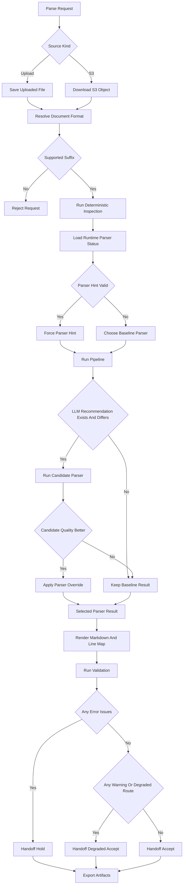
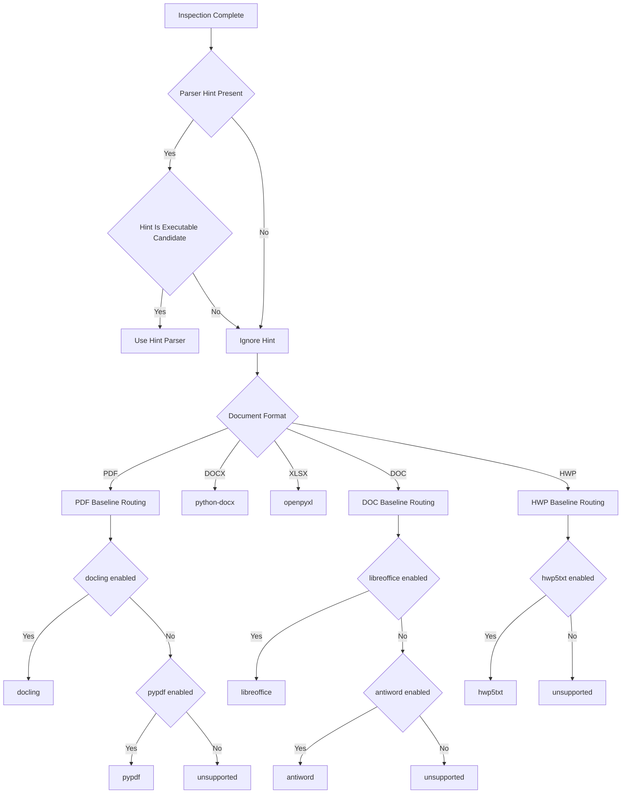
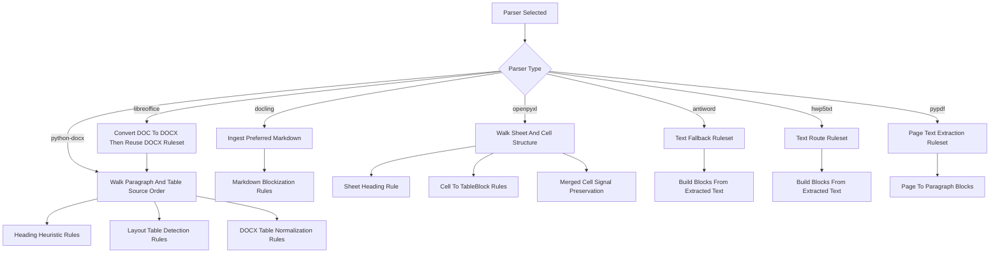
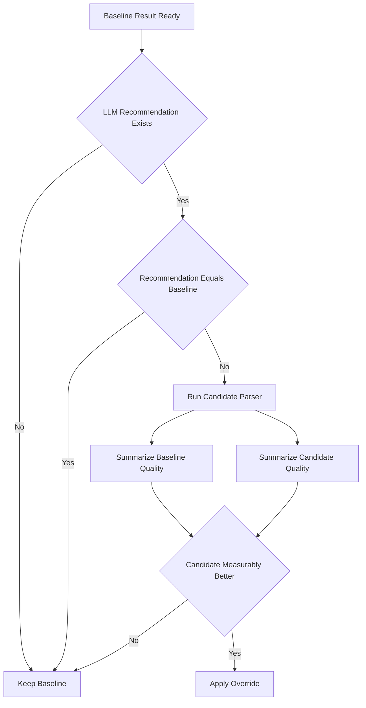
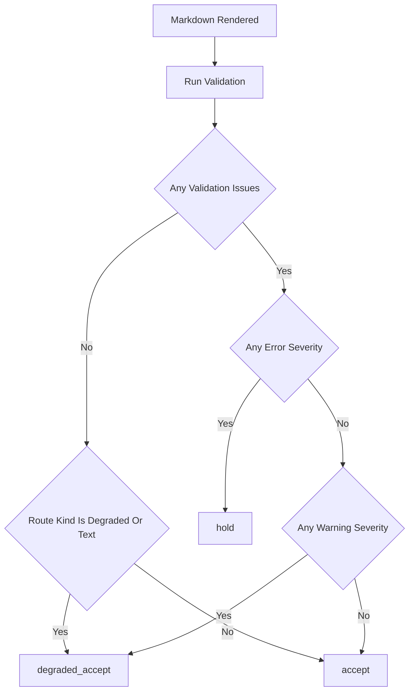
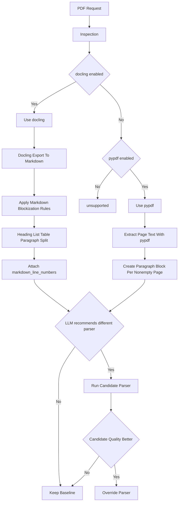
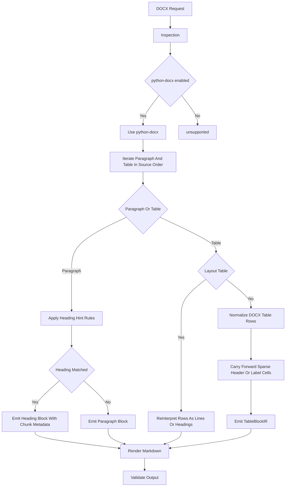
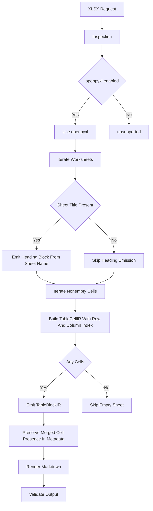
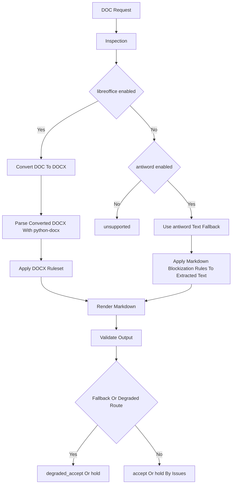
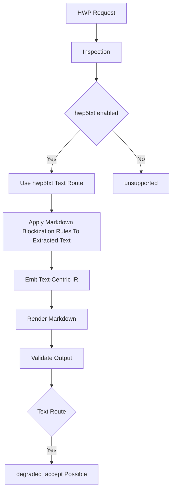

# 28. Parsing Decision Tree

이 문서는 현재 MarkBridge가 parse 요청을 받았을 때 어떤 분기와 기준으로 진행하는지 decision tree 형태로 정리한 문서다.

트리만 보여주는 문서가 아니라, 각 트리 아래에 해당 분기에서 실제로 적용되는 ruleset 표를 같이 둔다.

코드 기준 원본:

- [src/markbridge/api/service.py](/home/intak.kim/project/MarkBridge/src/markbridge/api/service.py)
- [src/markbridge/pipeline/orchestrator.py](/home/intak.kim/project/MarkBridge/src/markbridge/pipeline/orchestrator.py)
- [src/markbridge/routing/runtime.py](/home/intak.kim/project/MarkBridge/src/markbridge/routing/runtime.py)
- [src/markbridge/validators/gate.py](/home/intak.kim/project/MarkBridge/src/markbridge/validators/gate.py)

컨플루언스용 통합 문서:

- [30-confluence-parsing-guide.md](/home/intak.kim/project/MarkBridge/docs/30-confluence-parsing-guide.md)

## 1. 개요

### 목적

이 문서의 목적은 아래와 같다.

- parse 요청의 전체 분기 구조를 한 눈에 설명
- routing, validation, handoff 분기를 mermaid로 시각화
- 파일 포맷별로 어떤 parser branch를 타는지 분리해서 설명

### 범위

이 문서는 아래 decision tree를 다룬다.

- 전체 parse flow
- routing tree
- LLM routing comparison tree
- validation / handoff tree
- 파일 포맷별 parser selection tree

## 2. 전체 Decision Tree Flow

### 전체 Flow Ruleset

| rule_id | applies_to | trigger | action | risk | code_ref |
|---|---|---|---|---|---|
| `flow.source.upload_or_s3` | 전체 flow | source kind이 upload 또는 S3 | 획득 방식만 다르게 처리하고 이후 pipeline은 공통 진행 | source acquisition 오류가 parsing 전단에서 실패를 만든다 | [src/markbridge/api/app.py](/home/intak.kim/project/MarkBridge/src/markbridge/api/app.py), [src/markbridge/api/service.py](/home/intak.kim/project/MarkBridge/src/markbridge/api/service.py) |
| `flow.format.supported_suffix_gate` | 전체 flow | suffix가 지원 목록에 포함됨 | parse pipeline 진입 허용 | suffix 기반 판별이라 잘못된 확장자 문서엔 취약할 수 있음 | [src/markbridge/api/service.py](/home/intak.kim/project/MarkBridge/src/markbridge/api/service.py) |
| `flow.inspection.before_parse` | 전체 flow | parse request 수신 후 | inspection을 parser 실행 전에 먼저 수행 | inspection이 완전 품질 판정은 아니므로 routing 보조 신호로만 써야 함 | [src/markbridge/pipeline/orchestrator.py](/home/intak.kim/project/MarkBridge/src/markbridge/pipeline/orchestrator.py), [src/markbridge/inspection/basic.py](/home/intak.kim/project/MarkBridge/src/markbridge/inspection/basic.py) |
| `flow.render_then_validate` | 전체 flow | parser 결과가 IR로 생성됨 | markdown과 line map을 만들고 그 뒤 validation 수행 | renderer 품질이 validation evidence 매핑에 영향을 준다 | [src/markbridge/pipeline/orchestrator.py](/home/intak.kim/project/MarkBridge/src/markbridge/pipeline/orchestrator.py), [src/markbridge/renderers/markdown.py](/home/intak.kim/project/MarkBridge/src/markbridge/renderers/markdown.py) |
| `flow.export_after_handoff` | 전체 flow | handoff decision 계산 완료 | trace, markdown, issues, manifest 등 산출물 export | failed/degraded run도 artifact는 남으므로 소비자가 status를 같이 봐야 한다 | [src/markbridge/pipeline/orchestrator.py](/home/intak.kim/project/MarkBridge/src/markbridge/pipeline/orchestrator.py) |

## 3. 핵심 분기 설명

### Source / Format

- upload와 S3는 acquisition 방식만 다르고 이후 pipeline은 동일하다
- 지원 suffix가 아니면 parse가 시작되지 않는다

현재 지원 suffix:

- `pdf`
- `docx`
- `xlsx`
- `doc`
- `hwp`

### Routing

- routing은 현재 runtime에서 `enabled=true`인 parser만 고려한다
- `parser_hint`가 유효하면 baseline보다 먼저 적용된다
- 그렇지 않으면 deterministic baseline routing으로 진행한다
- 포맷 분기 이후에는 parser별 내부 ruleset이 추가 적용된다

### LLM Routing Comparison

- `llm_requested=true`여도 recommendation은 자동 적용되지 않는다
- baseline parser와 candidate parser를 둘 다 실행한 뒤 품질 신호를 비교한다
- candidate가 실제로 더 나을 때만 override가 적용된다

### Validation / Handoff

- error issue가 있으면 `hold`
- warning만 있거나 route 자체가 degraded면 `degraded_accept`
- 둘 다 아니면 `accept`

### Parser Ruleset Layer

- 실제 parsing은 "포맷 선택 -> parser 선택 -> parser 내부 ruleset 적용" 순서로 진행된다
- 같은 포맷이라도 heading/table/layout/fallback ruleset 때문에 결과가 달라진다
- 특히 `python-docx`, `docling` markdown ingestion, `openpyxl`는 내부 규칙 적용 비중이 높다

## 4. Routing Tree

### Routing Ruleset

| rule_id | applies_to | trigger | action | risk | code_ref |
|---|---|---|---|---|---|
| `routing.override.parser_hint` | 모든 포맷 | `parser_hint`가 executable candidate | baseline보다 먼저 hint parser 사용 | 잘못된 hint가 구조적으로 더 나쁜 parser를 고를 수 있으나 현재 executable candidate로 제한됨 | [src/markbridge/api/service.py](/home/intak.kim/project/MarkBridge/src/markbridge/api/service.py), [src/markbridge/routing/runtime.py](/home/intak.kim/project/MarkBridge/src/markbridge/routing/runtime.py) |
| `routing.pdf.docling_first` | PDF | `docling.enabled == true` | baseline parser를 `docling`으로 선택 | 더 무거운 route일 수 있음 | [src/markbridge/routing/runtime.py](/home/intak.kim/project/MarkBridge/src/markbridge/routing/runtime.py) |
| `routing.pdf.pypdf_fallback` | PDF | `docling` 비활성, `pypdf.enabled == true` | baseline parser를 `pypdf`로 선택 | layout/table fidelity가 약해질 수 있음 | [src/markbridge/routing/runtime.py](/home/intak.kim/project/MarkBridge/src/markbridge/routing/runtime.py) |
| `routing.docx.python_docx_only` | DOCX | `python-docx.enabled == true` | `python-docx` 선택 | 단일 route라 route-level 비교 여지가 적음 | [src/markbridge/routing/runtime.py](/home/intak.kim/project/MarkBridge/src/markbridge/routing/runtime.py) |
| `routing.xlsx.openpyxl_only` | XLSX | `openpyxl.enabled == true` | `openpyxl` 선택 | 단일 route라 구조 보정의 폭이 좁음 | [src/markbridge/routing/runtime.py](/home/intak.kim/project/MarkBridge/src/markbridge/routing/runtime.py) |
| `routing.doc.libreoffice_first` | DOC | `libreoffice.enabled == true` | conversion route 선택 | conversion 품질에 후속 parse 품질이 좌우됨 | [src/markbridge/routing/runtime.py](/home/intak.kim/project/MarkBridge/src/markbridge/routing/runtime.py), [src/markbridge/parsers/conversion.py](/home/intak.kim/project/MarkBridge/src/markbridge/parsers/conversion.py) |
| `routing.doc.antiword_fallback` | DOC | `libreoffice` 비활성, `antiword.enabled == true` | text fallback route 선택 | 구조 fidelity가 크게 낮아질 수 있음 | [src/markbridge/routing/runtime.py](/home/intak.kim/project/MarkBridge/src/markbridge/routing/runtime.py) |
| `routing.hwp.hwp5txt_text_route` | HWP | `hwp5txt.enabled == true` | text route 선택 | 구조 parser가 아니므로 degraded 해석 필요 | [src/markbridge/routing/runtime.py](/home/intak.kim/project/MarkBridge/src/markbridge/routing/runtime.py) |

## 5. Parser Ruleset Tree

현재 ruleset의 대표 사례:

- `docling` / `antiword` / `hwp5txt`
  - `_blocks_from_markdown()` 규칙 적용
  - heading 줄, list 줄, markdown table 줄, paragraph 버퍼를 분리
  - `markdown_line_numbers` metadata 부여
- `python-docx`
  - style 기반 heading 우선
  - numbered heading, `제 n 장/절/조`, 원문형 short title heuristic 적용
  - layout table이면 일반 table이 아니라 line/heading block으로 재해석
  - data table이면 carry-forward 포함 정규화 수행
- `openpyxl`
  - sheet title을 heading으로 materialize
  - non-empty cell을 `TableCellIR`로 적재
  - merged cell 존재 여부를 table metadata로 유지

### 공통 Parser Ruleset

| rule_id | applies_to | trigger | action | risk | code_ref |
|---|---|---|---|---|---|
| `common.markdown.preferred` | `docling`, `antiword`, `hwp5txt` 등 | `preferred_markdown` 존재 | renderer가 parser markdown을 우선 사용 | parser markdown 품질에 line map이 종속됨 | [src/markbridge/renderers/markdown.py](/home/intak.kim/project/MarkBridge/src/markbridge/renderers/markdown.py) |
| `common.markdown.line_map_from_metadata` | preferred markdown 경로 | `markdown_line_numbers` metadata 존재 | explicit line number 기반 line map 생성 | metadata가 틀리면 highlight mapping이 어긋남 | [src/markbridge/renderers/markdown.py](/home/intak.kim/project/MarkBridge/src/markbridge/renderers/markdown.py) |
| `common.markdown.line_map_fallback_match` | preferred markdown 경로 | explicit mapping이 없거나 부족함 | heuristic line match 수행 | exact line correspondence가 약할 수 있음 | [src/markbridge/renderers/markdown.py](/home/intak.kim/project/MarkBridge/src/markbridge/renderers/markdown.py) |

## 6. LLM Routing Comparison Tree

현재 비교에 반영되는 주요 품질 신호:

- `heading_count`
- `long_line_ratio`
- `very_long_line_ratio`
- `corruption_density`
- `formula_placeholder_density`
- `error_count`

### LLM Routing Comparison Ruleset

| rule_id | applies_to | trigger | action | risk | code_ref |
|---|---|---|---|---|---|
| `routing.llm.compare_before_override` | 주로 PDF | LLM recommendation이 baseline과 다름 | baseline/candidate 둘 다 실행 후 품질 비교 | 비용과 latency가 늘어남 | [src/markbridge/api/service.py](/home/intak.kim/project/MarkBridge/src/markbridge/api/service.py) |
| `routing.llm.keep_baseline_if_not_better` | LLM routing comparison | candidate 품질이 baseline보다 낫지 않음 | baseline 유지 | recommendation이 있어도 실제 적용되지 않을 수 있음 | [src/markbridge/api/service.py](/home/intak.kim/project/MarkBridge/src/markbridge/api/service.py) |
| `routing.quality.heading_count` | parser quality 비교 | markdown 생성됨 | heading count를 보존 품질 신호로 사용 | heading이 적은 문서에선 정보량이 낮을 수 있음 | [src/markbridge/api/service.py](/home/intak.kim/project/MarkBridge/src/markbridge/api/service.py) |
| `routing.quality.long_line_ratio` | parser quality 비교 | markdown 생성됨 | long/very long line 비율로 collapse risk 측정 | 원문 자체가 긴 줄 위주면 과벌점 가능 | [src/markbridge/api/service.py](/home/intak.kim/project/MarkBridge/src/markbridge/api/service.py) |
| `routing.quality.corruption_density` | parser quality 비교 | validation issue 존재 가능 | corruption density와 formula placeholder density 반영 | validator 탐지 범위 밖 손상은 반영 못함 | [src/markbridge/api/service.py](/home/intak.kim/project/MarkBridge/src/markbridge/api/service.py) |

## 7. Validation / Handoff Tree

validator의 핵심 기준:

- `empty_output`
- `text_corruption`
- `table_structure`

### Validation / Handoff Ruleset

| rule_id | applies_to | trigger | action | risk | code_ref |
|---|---|---|---|---|---|
| `validation.empty_output` | 모든 포맷 | block도 없고 markdown도 비어 있음 | `empty_output` error 생성 | parser 실패를 validation 단계에서 뒤늦게 노출할 수 있음 | [src/markbridge/validators/execution.py](/home/intak.kim/project/MarkBridge/src/markbridge/validators/execution.py) |
| `validation.text_corruption` | 모든 포맷 | replacement char, private-use glyph, formula placeholder 존재 | `text_corruption` warning 생성 | 외견상 멀쩡한 line도 수식 손상을 포함할 수 있음 | [src/markbridge/validators/execution.py](/home/intak.kim/project/MarkBridge/src/markbridge/validators/execution.py) |
| `validation.table_structure` | table block | header 부재 또는 row width variation 이상 | `table_structure` warning/error 생성 | merged table과 structural corruption을 완전히 구분하지 못함 | [src/markbridge/validators/execution.py](/home/intak.kim/project/MarkBridge/src/markbridge/validators/execution.py) |
| `handoff.error_to_hold` | 전체 flow | error severity issue 존재 | `hold` | warning-only 문서와 명확히 분리되나 false-positive error에 민감 | [src/markbridge/validators/gate.py](/home/intak.kim/project/MarkBridge/src/markbridge/validators/gate.py) |
| `handoff.warning_to_degraded_accept` | 전체 flow | warning severity issue 존재 | `degraded_accept` | downstream이 warning severity를 이해해야 함 | [src/markbridge/validators/gate.py](/home/intak.kim/project/MarkBridge/src/markbridge/validators/gate.py) |
| `handoff.degraded_route_adjustment` | degraded/text route | selected route_kind가 `degraded_fallback` 또는 `text_route` | handoff를 더 보수적으로 조정 | issue가 적어도 degraded 판정 가능 | [src/markbridge/pipeline/orchestrator.py](/home/intak.kim/project/MarkBridge/src/markbridge/pipeline/orchestrator.py) |

## 8. 파일 포맷 별 Decision Tree

### PDF

PDF ruleset 포인트:

- `docling` 경로는 `preferred_markdown` 보존이 핵심이다
- markdown ingestion 단계에서 heading, list, table, paragraph를 다시 block으로 나눈다
- table row width 차이는 이후 validation에서 merged-like signal로 사용된다
- `pypdf`는 layout-aware ruleset보다 page text extraction 성격이 강하다

#### PDF Ruleset

| rule_id | applies_to | trigger | action | risk | code_ref |
|---|---|---|---|---|---|
| `pdf.docling.export_markdown` | PDF + `docling` | `docling` parser 선택 | `export_to_markdown()` 결과 사용 | markdown export 품질에 직접 의존 | [src/markbridge/parsers/basic.py](/home/intak.kim/project/MarkBridge/src/markbridge/parsers/basic.py) |
| `pdf.docling.ocr_disabled` | PDF + `docling` | docling converter 생성 | OCR, formula enrichment, picture enrichment 비활성화 | image-heavy PDF text recovery 한계 | [src/markbridge/parsers/basic.py](/home/intak.kim/project/MarkBridge/src/markbridge/parsers/basic.py) |
| `pdf.markdown.heading_split` | docling markdown ingestion | line이 `#`로 시작 | heading block 생성 및 level 계산 | parser heading 품질 의존 | [src/markbridge/parsers/basic.py](/home/intak.kim/project/MarkBridge/src/markbridge/parsers/basic.py) |
| `pdf.markdown.list_split` | docling markdown ingestion | line이 `- ` 또는 `* `로 시작 | list block 생성 | list/paragraph 경계 왜곡 가능 | [src/markbridge/parsers/basic.py](/home/intak.kim/project/MarkBridge/src/markbridge/parsers/basic.py) |
| `pdf.markdown.table_split` | docling markdown ingestion | line이 markdown table row 패턴에 부합 | `TableBlockIR` 생성, row length 기록 | complex table 손실 가능 | [src/markbridge/parsers/basic.py](/home/intak.kim/project/MarkBridge/src/markbridge/parsers/basic.py) |
| `pdf.markdown.line_numbers` | docling markdown ingestion | markdown block 생성 | `markdown_line_numbers` metadata 부여 | later highlight가 parser line에 종속 | [src/markbridge/parsers/basic.py](/home/intak.kim/project/MarkBridge/src/markbridge/parsers/basic.py) |
| `pdf.pypdf.page_to_paragraph` | PDF + `pypdf` | 페이지별 추출 text가 non-empty | 페이지 단위 paragraph block 생성 | heading/table 정보가 거의 사라질 수 있음 | [src/markbridge/parsers/basic.py](/home/intak.kim/project/MarkBridge/src/markbridge/parsers/basic.py) |

### DOCX

DOCX ruleset 포인트:

- heading rules는 style 기반 규칙이 최우선이다
- style이 약하면 numbered heading, `제 n 장/절/조`, circled number, short heading heuristic이 들어간다
- table은 먼저 layout table인지 판정한다
- layout table이면 표가 아니라 텍스트/heading 블록으로 다시 푼다
- data table이면 carry-forward 규칙으로 비어 있는 셀을 보정해 구조를 안정화한다

#### DOCX Ruleset

| rule_id | applies_to | trigger | action | risk | code_ref |
|---|---|---|---|---|---|
| `docx.iter.source_order` | DOCX | `python-docx` parser 선택 | paragraph/table을 body 순서대로 순회 | OOXML order 품질 의존 | [src/markbridge/parsers/basic.py](/home/intak.kim/project/MarkBridge/src/markbridge/parsers/basic.py) |
| `docx.heading.style_priority` | DOCX paragraph | style name이 heading/title 계열 | style 기반 heading block 생성 | style 품질에 민감 | [src/markbridge/parsers/basic.py](/home/intak.kim/project/MarkBridge/src/markbridge/parsers/basic.py) |
| `docx.heading.numbered_pattern` | DOCX paragraph | numbered heading regex match | numbered heading 인식과 level 계산 | 목록 문장 오탐 가능 | [src/markbridge/parsers/basic.py](/home/intak.kim/project/MarkBridge/src/markbridge/parsers/basic.py) |
| `docx.heading.korean_section` | DOCX paragraph | `제 n 장/절/조` 패턴 match | korean section heading 인식 | 문장 내부 법조문 표현과 충돌 가능 | [src/markbridge/parsers/basic.py](/home/intak.kim/project/MarkBridge/src/markbridge/parsers/basic.py) |
| `docx.heading.circled_number` | DOCX paragraph | circled number 패턴과 주변 문맥 충족 | section heading 인식 | step list와 구분 어려움 | [src/markbridge/parsers/basic.py](/home/intak.kim/project/MarkBridge/src/markbridge/parsers/basic.py) |
| `docx.heading.short_title` | DOCX paragraph | 짧은 제목 heuristic 충족 | short title heading 인식 | 짧은 설명문을 heading으로 올릴 수 있음 | [src/markbridge/parsers/basic.py](/home/intak.kim/project/MarkBridge/src/markbridge/parsers/basic.py) |
| `docx.table.layout_detection` | DOCX table | single-cell line 성격의 row만 존재 | table 대신 layout note/text 블록으로 재해석 | 실제 단일열 표 오분류 가능 | [src/markbridge/parsers/basic.py](/home/intak.kim/project/MarkBridge/src/markbridge/parsers/basic.py) |
| `docx.table.horizontal_duplicate_suppression` | DOCX table | 가로 병합 duplicate text 반복 | duplicate header text 공백 처리 | 동일 label 의미 약화 가능 | [src/markbridge/parsers/basic.py](/home/intak.kim/project/MarkBridge/src/markbridge/parsers/basic.py) |
| `docx.table.header_span_expand` | DOCX table | header row 빈 셀이 후속 body 값과 연결 | 좌측 header label span 확장 | 독립 공란 column 오채움 가능 | [src/markbridge/parsers/basic.py](/home/intak.kim/project/MarkBridge/src/markbridge/parsers/basic.py) |
| `docx.table.header_row_merge` | DOCX table | 상단 2개 row가 repeated/differing pattern 충족 | 2행 header를 하나의 merged header로 합침 | 다층 header 의미 압축 가능 | [src/markbridge/parsers/basic.py](/home/intak.kim/project/MarkBridge/src/markbridge/parsers/basic.py) |
| `docx.table.repeated_header_refine` | DOCX table | 동일 header label 반복 | code-like column 고려해 header label 변형 | 원문 wording 변경 가능 | [src/markbridge/parsers/basic.py](/home/intak.kim/project/MarkBridge/src/markbridge/parsers/basic.py) |
| `docx.table.carry_forward_sparse_cells` | DOCX table | 앞쪽 label column 비어 있고 carry-forward 조건 충족 | 이전 값을 현재 row 앞쪽 cell에 보정 | row semantics 변경 가능 | [src/markbridge/parsers/basic.py](/home/intak.kim/project/MarkBridge/src/markbridge/parsers/basic.py) |
| `docx.table.drop_empty_columns` | DOCX table | 완전 빈 column 존재 | 빈 column 제거 | 공간 의미 있는 빈 열이 사라질 수 있음 | [src/markbridge/parsers/basic.py](/home/intak.kim/project/MarkBridge/src/markbridge/parsers/basic.py) |

### XLSX

XLSX ruleset 포인트:

- sheet title이 section heading 역할을 한다
- non-empty cell만 IR로 적재한다
- formula 값은 `data_only=False` 상태로 읽어 원문 기호를 보존하려고 한다
- merged cell 존재 여부는 table metadata와 validation 판단에 영향을 준다

#### XLSX Ruleset

| rule_id | applies_to | trigger | action | risk | code_ref |
|---|---|---|---|---|---|
| `xlsx.sheet_heading` | XLSX worksheet | `sheet.title` non-empty | sheet name heading block 생성 | sheet 이름이 실제 section 제목이 아닐 수 있음 | [src/markbridge/parsers/basic.py](/home/intak.kim/project/MarkBridge/src/markbridge/parsers/basic.py) |
| `xlsx.cell_nonempty_only` | XLSX worksheet | cell value가 `None` 아님 | non-empty cell만 `TableCellIR`로 적재 | 빈 셀 spacing 의미 미반영 | [src/markbridge/parsers/basic.py](/home/intak.kim/project/MarkBridge/src/markbridge/parsers/basic.py) |
| `xlsx.first_row_header_assumption` | XLSX table | table cell 적재 시 row index 0 | 첫 행을 header로 표시 | 실제 header가 여러 행일 수 있음 | [src/markbridge/parsers/basic.py](/home/intak.kim/project/MarkBridge/src/markbridge/parsers/basic.py) |
| `xlsx.merged_cell_signal` | XLSX table | merged range 존재 | `merged_cells=True` 설정 | merge span 자체는 복원하지 않음 | [src/markbridge/parsers/basic.py](/home/intak.kim/project/MarkBridge/src/markbridge/parsers/basic.py) |
| `xlsx.formula_literal_preserve` | XLSX workbook | workbook open 시 | `data_only=False`로 formula literal 보존 | 계산 결과 중심 사용성은 낮아질 수 있음 | [src/markbridge/parsers/basic.py](/home/intak.kim/project/MarkBridge/src/markbridge/parsers/basic.py) |

### DOC

DOC ruleset 포인트:

- `libreoffice` 경로는 사실상 "변환 후 DOCX ruleset 재사용"이다
- `antiword` 경로는 구조 parser가 아니라 text fallback ruleset이다
- 같은 DOC라도 어떤 route를 탔는지에 따라 구조 fidelity 차이가 크다
- 그래서 route kind 자체가 handoff 판단에 반영된다

#### DOC Ruleset

| rule_id | applies_to | trigger | action | risk | code_ref |
|---|---|---|---|---|---|
| `doc.libreoffice.convert_then_docx` | DOC + `libreoffice` | `libreoffice` route 선택 | DOC를 DOCX로 변환 후 DOCX ruleset 재사용 | conversion loss가 생기면 후속 복구 어려움 | [src/markbridge/parsers/basic.py](/home/intak.kim/project/MarkBridge/src/markbridge/parsers/basic.py), [src/markbridge/parsers/conversion.py](/home/intak.kim/project/MarkBridge/src/markbridge/parsers/conversion.py) |
| `doc.antiword.text_fallback` | DOC + `antiword` | `antiword` route 선택 | text 추출 후 markdown blockization 적용 | 구조/표/section fidelity가 크게 낮아질 수 있음 | [src/markbridge/parsers/basic.py](/home/intak.kim/project/MarkBridge/src/markbridge/parsers/basic.py) |
| `doc.antiword.preferred_markdown` | DOC + `antiword` | antiword extraction 성공 | extracted text를 `preferred_markdown`으로 사용 | extraction artifacts가 그대로 노출될 수 있음 | [src/markbridge/parsers/basic.py](/home/intak.kim/project/MarkBridge/src/markbridge/parsers/basic.py) |

### HWP

HWP ruleset 포인트:

- 현재는 구조 parser보다 text route 성격이 강하다
- heading/list/table이 있더라도 extracted text 표현에 의존한다
- route kind가 `text_route`라서 issue가 없어도 handoff가 degraded가 될 수 있다

#### HWP Ruleset

| rule_id | applies_to | trigger | action | risk | code_ref |
|---|---|---|---|---|---|
| `hwp.hwp5txt.text_route` | HWP + `hwp5txt` | `hwp5txt` route 선택 | text 추출 후 markdown blockization 적용 | layout-aware parsing이 아니라 text route 중심 | [src/markbridge/parsers/basic.py](/home/intak.kim/project/MarkBridge/src/markbridge/parsers/basic.py) |
| `hwp.hwp5txt.preferred_markdown` | HWP + `hwp5txt` | extraction 성공 | extracted text를 `preferred_markdown`으로 사용 | line break와 구조 표식 품질에 직접 의존 | [src/markbridge/parsers/basic.py](/home/intak.kim/project/MarkBridge/src/markbridge/parsers/basic.py) |

## 9. Repair Ruleset

| rule_id | applies_to | trigger | action | risk | code_ref |
|---|---|---|---|---|---|
| `repair.formula.class_gate` | validation issue | `text_corruption`이면서 corruption class가 formula-like | formula repair candidate 생성을 허용 | 일반 glyph corruption은 이 경로를 타지 않음 | [src/markbridge/repairs/formula.py](/home/intak.kim/project/MarkBridge/src/markbridge/repairs/formula.py) |
| `repair.formula.placeholder_llm_required` | formula placeholder | corruption class가 `formula_placeholder` | deterministic patch 없이 `llm_required` candidate 생성 | 자동 복원이 사실상 불가해 review 의존 | [src/markbridge/repairs/formula.py](/home/intak.kim/project/MarkBridge/src/markbridge/repairs/formula.py) |
| `repair.formula.private_use_transliteration` | formula-like corruption | private-use glyph 존재 | transliteration table로 문자 치환 | 올바른 수식 토큰으로 완전히 복원되지 않을 수 있음 | [src/markbridge/repairs/formula.py](/home/intak.kim/project/MarkBridge/src/markbridge/repairs/formula.py) |
| `repair.formula.normalize_span` | formula candidate | formula span 추출 성공 | 수식 span 정규화와 confidence 계산 | 표 라벨과 수식 span 혼동 가능 | [src/markbridge/repairs/formula.py](/home/intak.kim/project/MarkBridge/src/markbridge/repairs/formula.py) |

## 10. 운영자가 가장 자주 확인할 판단 포인트

현재 parse 요청을 볼 때는 아래 질문 순서로 보면 된다.

1. 어떤 format으로 해석됐는가?
2. runtime에서 어떤 parser가 enabled였는가?
3. baseline parser는 무엇이었는가?
4. 선택된 parser 안에서 어떤 ruleset이 적용됐는가?
5. LLM recommendation이 있었는가?
6. recommendation이 실제 override됐는가?
7. validation issue는 warning인지 error인지?
8. 최종 handoff가 `accept`, `degraded_accept`, `hold` 중 무엇인가?

이 질문에 대한 답은 주로 아래에서 확인한다.

- [docs/09-runtime-parser-status.md](/home/intak.kim/project/MarkBridge/docs/09-runtime-parser-status.md)
- [src/markbridge/api/service.py](/home/intak.kim/project/MarkBridge/src/markbridge/api/service.py)
- [src/markbridge/pipeline/orchestrator.py](/home/intak.kim/project/MarkBridge/src/markbridge/pipeline/orchestrator.py)
