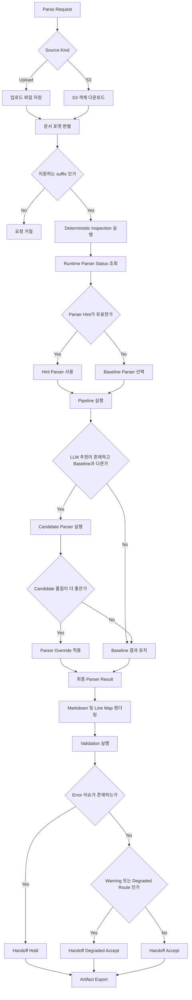
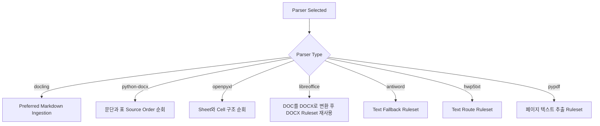
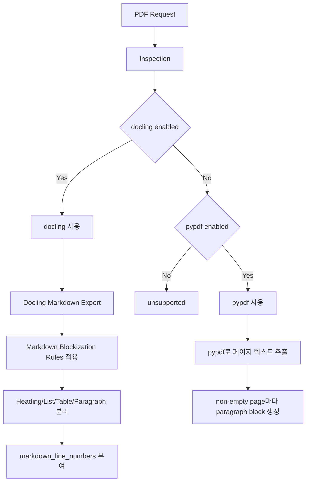
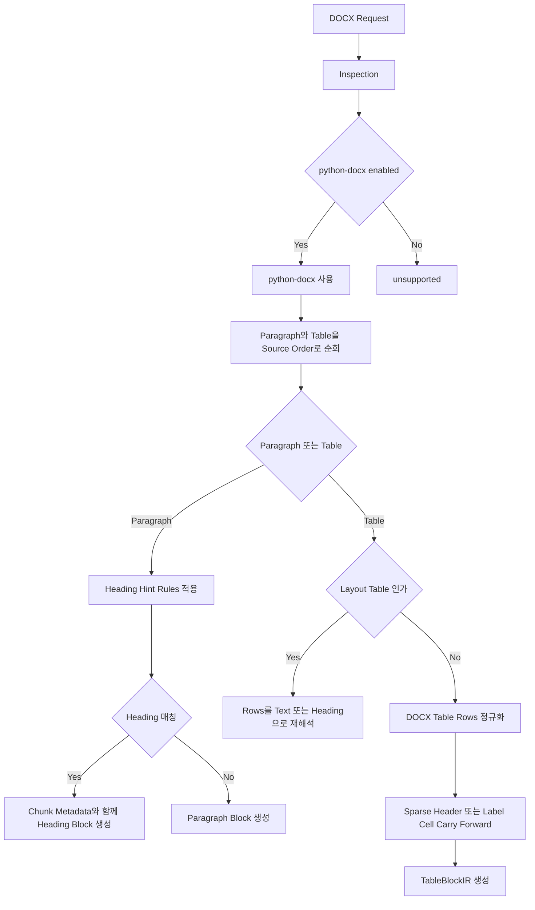
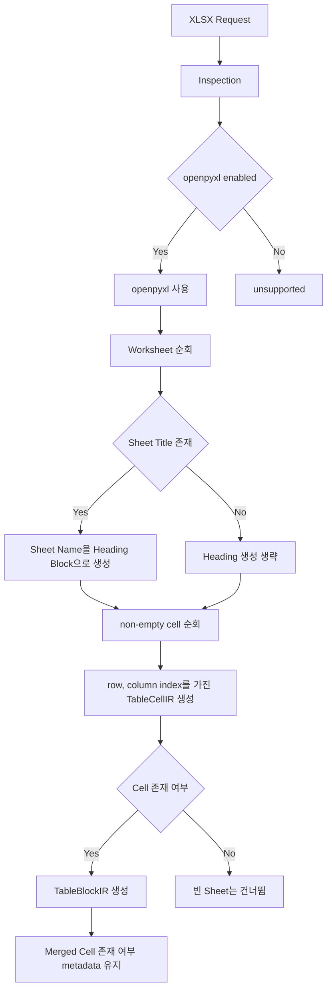
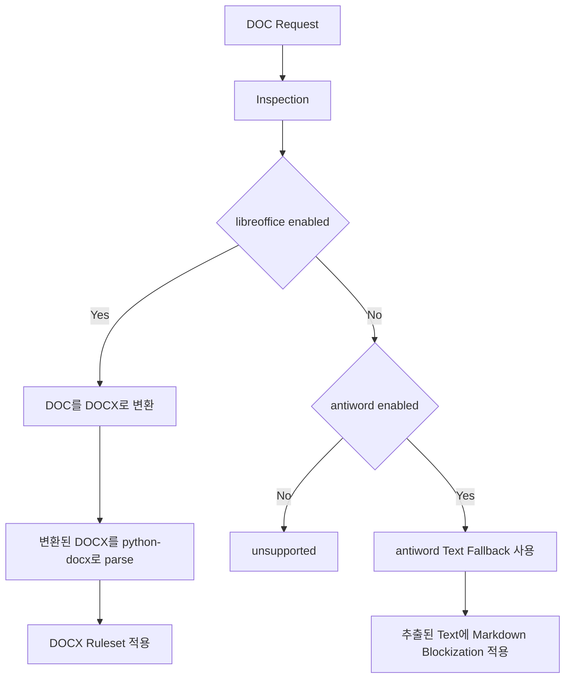
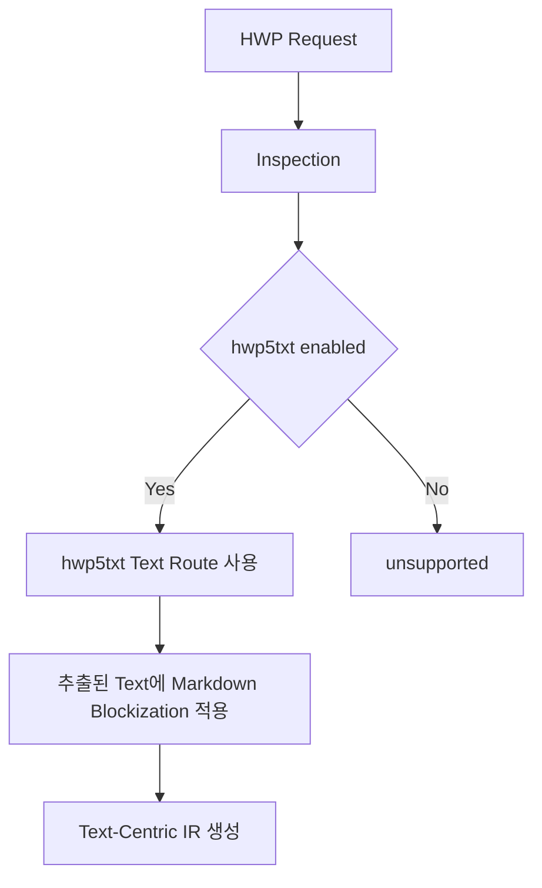

# MarkBridge 파싱 런타임 및 의사결정 가이드

## 1. 문서 목적

이 문서는 MarkBridge의 현재 파싱 동작을 컨플루언스에 바로 옮겨 적을 수 있도록 정리한 통합 문서다.

이 문서의 목적은 아래와 같다.

- 현재 parsing이 end-to-end로 어떻게 동작하는지 설명
- routing 의사결정이 어떤 기준으로 내려지는지 설명
- 파일 포맷 분기 이후 parser 내부 ruleset이 어떻게 적용되는지 설명
- validation과 handoff 결정 기준을 설명
- 현재 품질 판단에 쓰는 핵심 신호를 정리

## 2. 문서 범위

이 문서는 아래 범위를 포함한다.

- source acquisition
- format resolution
- deterministic inspection
- runtime-aware routing
- parser execution
- parser-internal ruleset
- markdown rendering
- validation
- repair candidate generation
- downstream handoff decision

이 문서는 아래 범위를 포함하지 않는다.

- downstream chunking
- embedding generation
- retrieval orchestration
- answer generation

## 3. 핵심 용어

| 용어 | 의미 |
|---|---|
| Source Acquisition | 업로드 파일을 받거나 S3 객체를 내려받아 parse 가능한 입력 파일로 준비하는 단계 |
| Document Format | 입력 파일의 논리 포맷. 현재 PDF, DOCX, XLSX, DOC, HWP를 의미 |
| Inspection | parser 실행 전에 수행하는 저비용 deterministic feature extraction 단계 |
| Runtime Status | 현재 실행 환경에서 parser가 설치되어 있고 활성화되어 있는지 나타내는 상태 |
| Baseline Parser | deterministic routing이 기본으로 선택한 parser |
| Parser Override | parser hint 또는 LLM 비교 결과에 따라 baseline 대신 선택된 parser |
| Preferred Markdown | parser가 직접 만든 markdown을 우선 보존하는 출력 경로 |
| IR | parser 이후 공통 구조로 쓰는 Intermediate Representation |
| Validation Issue | 렌더링 이후 deterministic rule로 탐지한 품질 이슈 |
| Handoff Decision | 최종 결과 상태. `accept`, `degraded_accept`, `hold` 중 하나 |
| Route Kind | parser route의 역할. `primary`, `fallback`, `degraded_fallback`, `text_route` 등 |

## 4. 전체 처리 흐름

1. 업로드 또는 S3에서 source를 획득한다.
2. 지원되는 suffix를 기준으로 document format을 판별한다.
3. deterministic inspection을 실행한다.
4. 현재 runtime의 parser 활성 상태를 확인한다.
5. baseline parser를 선택한다.
6. 필요하면 LLM 추천 parser를 baseline과 비교한다.
7. parser를 실행하고 공통 IR을 만든다.
8. markdown와 markdown line map을 렌더링한다.
9. validation checks를 수행한다.
10. downstream handoff decision을 계산한다.
11. repair candidate와 run artifact를 생성한다.

## 5. 전체 Decision Tree

## 6. 전체 공통 Ruleset

### 6.1 Flow Ruleset

| Rule ID | Trigger | Action | Risk |
|---|---|---|---|
| `flow.source.upload_or_s3` | 요청이 upload 또는 S3에서 시작됨 | 획득 방식만 다르게 처리하고 이후 pipeline은 공통으로 진행 | parsing 시작 전에 source acquisition 실패가 날 수 있음 |
| `flow.format.supported_suffix_gate` | suffix가 지원 포맷 목록에 포함됨 | parse pipeline 진입 허용 | 잘못된 파일 확장자가 format 판별을 왜곡할 수 있음 |
| `flow.inspection.before_parse` | parse request가 수락됨 | parser 실행 전에 inspection 수행 | inspection은 보조 신호이지 완전한 품질 판정은 아님 |
| `flow.render_then_validate` | parser output이 IR로 생성됨 | markdown를 먼저 렌더링하고 이후 validation 수행 | rendering 품질이 issue-to-line 매핑 품질에 영향을 줌 |
| `flow.export_after_handoff` | handoff decision이 계산됨 | trace, markdown, issues, manifest 등 산출물 export | failed/degraded run도 artifact가 생성되므로 status를 함께 봐야 함 |

### 6.2 Routing Ruleset

| Rule ID | Trigger | Action | Risk |
|---|---|---|---|
| `routing.override.parser_hint` | parser hint가 executable candidate임 | baseline routing보다 먼저 hint parser 사용 | 유효하지만 더 약한 parser도 강제로 선택될 수 있음 |
| `routing.pdf.docling_first` | PDF이고 `docling`이 enabled 상태 | baseline parser를 `docling`으로 선택 | text-only extractor보다 무거울 수 있음 |
| `routing.pdf.pypdf_fallback` | PDF이고 `docling`은 없지만 `pypdf`는 enabled | baseline parser를 `pypdf`로 선택 | layout과 table fidelity가 약해질 수 있음 |
| `routing.docx.python_docx_only` | DOCX이고 `python-docx`가 enabled | `python-docx` 선택 | 활성 대체 route가 없음 |
| `routing.xlsx.openpyxl_only` | XLSX이고 `openpyxl`가 enabled | `openpyxl` 선택 | 활성 대체 route가 없음 |
| `routing.doc.libreoffice_first` | DOC이고 `libreoffice`가 enabled | conversion route를 우선 사용 | conversion 품질이 후속 parse 품질에 직접 영향 |
| `routing.doc.antiword_fallback` | DOC이고 `antiword`만 enabled | text fallback route 사용 | 구조 fidelity가 크게 낮아질 수 있음 |
| `routing.hwp.hwp5txt_text_route` | HWP이고 `hwp5txt`가 enabled | text route 사용 | layout-aware parser가 아님 |

### 6.3 LLM Routing Ruleset

| Rule ID | Trigger | Action | Risk |
|---|---|---|---|
| `routing.llm.compare_before_override` | LLM recommendation이 baseline과 다름 | baseline과 candidate를 둘 다 실행한 뒤 품질 비교 | latency와 비용 증가 |
| `routing.llm.keep_baseline_if_not_better` | candidate 품질이 baseline보다 낫지 않음 | baseline parser 유지 | recommendation이 보여도 실제 적용되지 않을 수 있음 |
| `routing.quality.heading_count` | markdown가 생성됨 | heading count를 구조 보존 신호로 사용 | heading이 적은 문서에는 정보량이 약함 |
| `routing.quality.long_line_ratio` | markdown가 생성됨 | long-line ratio로 collapse risk 판단 | 원문 자체가 긴 줄 위주면 과벌점 가능 |
| `routing.quality.corruption_density` | validation issue가 존재할 수 있음 | corruption density와 formula placeholder density 반영 | 현재 validator가 잡는 손상만 반영 가능 |

### 6.4 Validation / Handoff Ruleset

| Rule ID | Trigger | Action | Risk |
|---|---|---|---|
| `validation.empty_output` | block이 없고 markdown도 비어 있음 | `empty_output` error 생성 | parser 실패를 validation 단계에서 뒤늦게 노출 |
| `validation.text_corruption` | broken glyph, private-use glyph, formula placeholder 탐지 | `text_corruption` warning 생성 | 육안상 괜찮아 보여도 수식 손상이 포함될 수 있음 |
| `validation.table_structure` | table header 부재 또는 row width variation 이상 | `table_structure` warning 또는 error 생성 | merged table과 구조 손상을 완전히 분리하지 못함 |
| `handoff.error_to_hold` | error issue가 하나라도 존재 | `hold`로 결정 | false-positive error에 민감 |
| `handoff.warning_to_degraded_accept` | warning issue만 존재 | `degraded_accept`로 결정 | downstream이 warning-grade risk를 이해해야 함 |
| `handoff.degraded_route_adjustment` | route kind가 `degraded_fallback` 또는 `text_route` | handoff를 더 보수적으로 낮춤 | issue가 적어도 degraded 상태가 될 수 있음 |

## 7. Parser Ruleset Layer

MarkBridge parsing은 "파일 포맷 분기 -> parser 선택"에서 끝나지 않는다. 선택된 parser는 각각 별도의 내부 ruleset을 적용한다.

### 공통 Parser Ruleset

| Rule ID | Trigger | Action | Risk |
|---|---|---|---|
| `common.markdown.preferred` | preferred markdown가 존재 | renderer가 parser-produced markdown를 직접 사용 | line map 품질이 parser markdown 품질에 종속 |
| `common.markdown.line_map_from_metadata` | `markdown_line_numbers` metadata가 존재 | explicit line number 기반 line map 생성 | 잘못된 metadata가 highlight 품질을 낮춤 |
| `common.markdown.line_map_fallback_match` | explicit line mapping이 없거나 불완전 | heuristic line match 사용 | exact line correspondence가 약해질 수 있음 |

## 8. 포맷별 Decision Tree 및 Ruleset

### 8.1 PDF

| Rule ID | Trigger | Action | Risk |
|---|---|---|---|
| `pdf.docling.export_markdown` | `docling` 선택 | `export_to_markdown()` 결과 사용 | export 품질이 parse 품질에 직접 영향 |
| `pdf.docling.ocr_disabled` | docling converter 생성 | OCR과 enrichment 옵션 비활성화 | image-heavy PDF는 취약 |
| `pdf.markdown.heading_split` | markdown line이 `#`로 시작 | heading block과 level 생성 | parser heading 품질에 의존 |
| `pdf.markdown.list_split` | markdown line이 list marker로 시작 | list block 생성 | list 경계가 원문과 다를 수 있음 |
| `pdf.markdown.table_split` | markdown row pattern 탐지 | `TableBlockIR`와 row-length metadata 생성 | complex table 손실 가능 |
| `pdf.markdown.line_numbers` | markdown block 생성 | `markdown_line_numbers` metadata 부여 | highlight mapping이 parser line에 종속 |
| `pdf.pypdf.page_to_paragraph` | `pypdf` page text가 non-empty | page별 paragraph block 생성 | heading/table 정보가 사라질 수 있음 |

### 8.2 DOCX

| Rule ID | Trigger | Action | Risk |
|---|---|---|---|
| `docx.iter.source_order` | `python-docx` 선택 | paragraph/table을 body order로 순회 | OOXML irregularity가 있으면 기대 순서와 다를 수 있음 |
| `docx.heading.style_priority` | heading/title style 탐지 | style 기반 heading block 생성 | source style 품질에 민감 |
| `docx.heading.numbered_pattern` | numbered heading regex match | paragraph를 heading으로 인식하고 level 계산 | numbered list를 오탐할 수 있음 |
| `docx.heading.korean_section` | `제 n 장/절/조` 패턴 match | structured section heading으로 인식 | 문장 내부 법조문 표현과 충돌 가능 |
| `docx.heading.circled_number` | circled-number pattern과 local context match | section heading으로 인식 | step list와 혼동 가능 |
| `docx.heading.short_title` | short-title heuristic match | 짧은 문단을 heading으로 승격 | 짧은 설명문을 잘못 승격할 수 있음 |
| `docx.table.layout_detection` | single-cell line 형태의 table rows | note/text 구조로 재해석 | 실제 one-column table 오분류 가능 |
| `docx.table.horizontal_duplicate_suppression` | merged-text duplicate가 가로로 반복 | duplicate label 제거 | 의미 있는 repeated label이 약해질 수 있음 |
| `docx.table.header_span_expand` | empty header cell이 이전 label을 이어받는다고 판단 | header span 확장 | 독립 empty column이 과채움될 수 있음 |
| `docx.table.header_row_merge` | 상단 2개 header row가 merge pattern 충족 | 2행 header를 1행 merged header로 축약 | multi-level header 의미 압축 |
| `docx.table.repeated_header_refine` | header label 반복 | 더 구체적인 label로 재작성 | source wording과 달라질 수 있음 |
| `docx.table.carry_forward_sparse_cells` | sparse label cell이 carry-forward 조건 충족 | 이전 row 값을 현재 row 앞단 cell에 보정 | row semantics 왜곡 가능 |
| `docx.table.drop_empty_columns` | 완전 빈 column 존재 | empty column 제거 | spacing purpose의 빈 열 손실 |

### 8.3 XLSX

| Rule ID | Trigger | Action | Risk |
|---|---|---|---|
| `xlsx.sheet_heading` | sheet title이 non-empty | sheet name을 heading block으로 생성 | sheet 이름이 실제 section 제목이 아닐 수 있음 |
| `xlsx.cell_nonempty_only` | cell value가 non-`None` | non-empty cell만 `TableCellIR`로 적재 | empty spacing 의미 미보존 |
| `xlsx.first_row_header_assumption` | row 0에서 table cell 적재 | 첫 행을 header로 간주 | 실제 header가 여러 행일 수 있음 |
| `xlsx.merged_cell_signal` | merged range 존재 | table을 merged로 표시 | merge span 자체는 복원되지 않음 |
| `xlsx.formula_literal_preserve` | workbook open | `data_only=False`로 formula literal 보존 | 계산 결과 중심 소비자에겐 불편 가능 |

### 8.4 DOC

| Rule ID | Trigger | Action | Risk |
|---|---|---|---|
| `doc.libreoffice.convert_then_docx` | `libreoffice` route 선택 | DOC를 DOCX로 변환 후 DOCX ruleset 재사용 | conversion loss가 생기면 복구 어려움 |
| `doc.antiword.text_fallback` | `antiword` route 선택 | text extraction 후 markdown blockization 적용 | 구조 fidelity 급락 가능 |
| `doc.antiword.preferred_markdown` | `antiword` extraction 성공 | extracted text를 preferred markdown으로 사용 | extraction artifact가 그대로 노출 |

### 8.5 HWP

| Rule ID | Trigger | Action | Risk |
|---|---|---|---|
| `hwp.hwp5txt.text_route` | `hwp5txt` route 선택 | text extraction 후 markdown blockization 적용 | layout-aware parser가 아니라 text route 중심 |
| `hwp.hwp5txt.preferred_markdown` | extraction 성공 | extracted text를 preferred markdown으로 사용 | line break와 구조 표식 품질이 extracted text에 전적으로 의존 |

## 9. Repair Ruleset

| Rule ID | Trigger | Action | Risk |
|---|---|---|---|
| `repair.formula.class_gate` | `text_corruption`이 formula-like로 분류됨 | formula repair candidate 생성 허용 | 일반 glyph corruption은 이 경로를 타지 않음 |
| `repair.formula.placeholder_llm_required` | corruption class가 `formula_placeholder` | deterministic patch 없이 `llm_required` candidate 생성 | review가 필수 |
| `repair.formula.private_use_transliteration` | private-use glyph 존재 | transliteration table로 문자 치환 | 수학적으로 완전하지 않을 수 있음 |
| `repair.formula.normalize_span` | formula span 추출 성공 | 수식 span 정규화 및 confidence 계산 | table label과 formula span 혼동 가능 |

## 10. 품질 판단 신호

### 10.1 Validation Signal

- `empty_output`
- `text_corruption`
- `table_structure`

### 10.2 LLM Routing Comparison Signal

- `heading_count`
- `long_line_ratio`
- `very_long_line_ratio`
- `corruption_density`
- `formula_placeholder_density`
- `error_count`

### 10.3 Handoff State

| 상태 | 의미 |
|---|---|
| `accept` | blocking issue가 없고 degraded-route adjustment도 없음 |
| `degraded_accept` | warning-grade issue가 있거나 degraded/text route가 적용됨 |
| `hold` | blocking issue가 있거나 executable route가 없음 |

## 11. 컨플루언스 게시 팁

- 이 문서는 markdown 기반이라 컨플루언스에 그대로 붙여넣은 뒤 heading/table/mermaid만 확인하면 된다.
- 컨플루언스 페이지를 분리하려면 아래 순서로 쪼개는 것이 좋다.
  1. 개요 및 용어
  2. 전체 flow 및 공통 ruleset
  3. 포맷별 decision tree 및 ruleset
  4. validation / repair / handoff 기준
