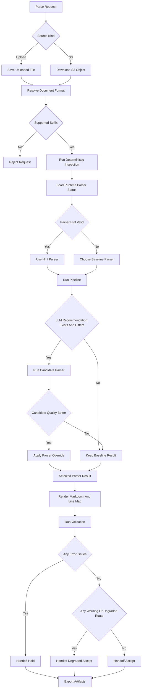
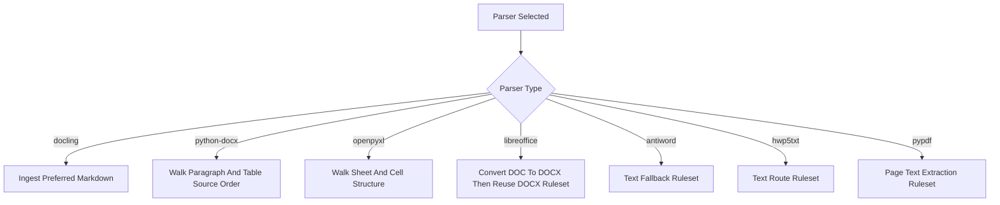
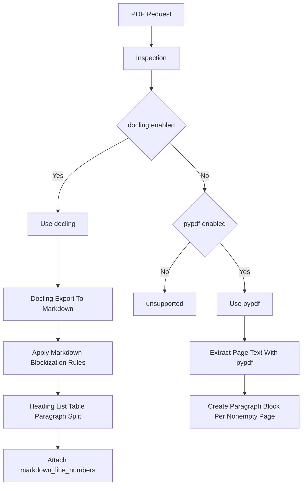
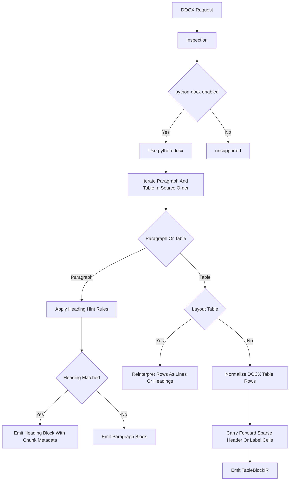
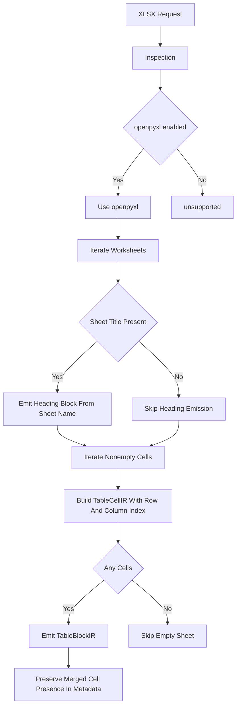
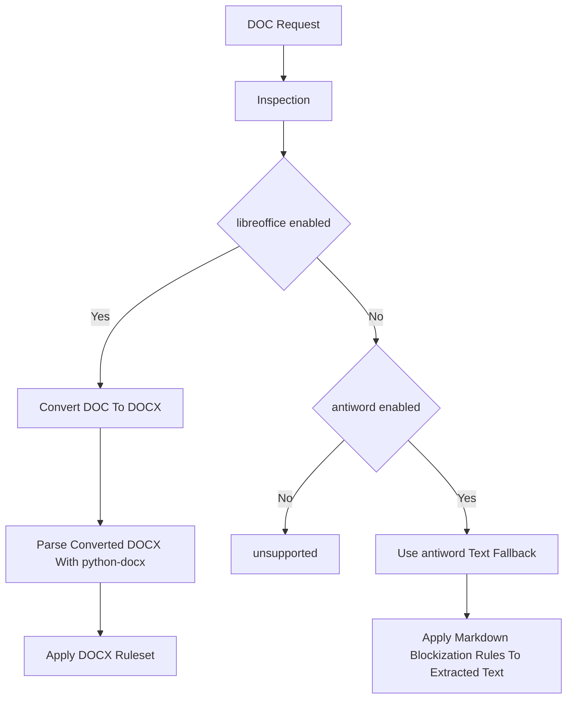
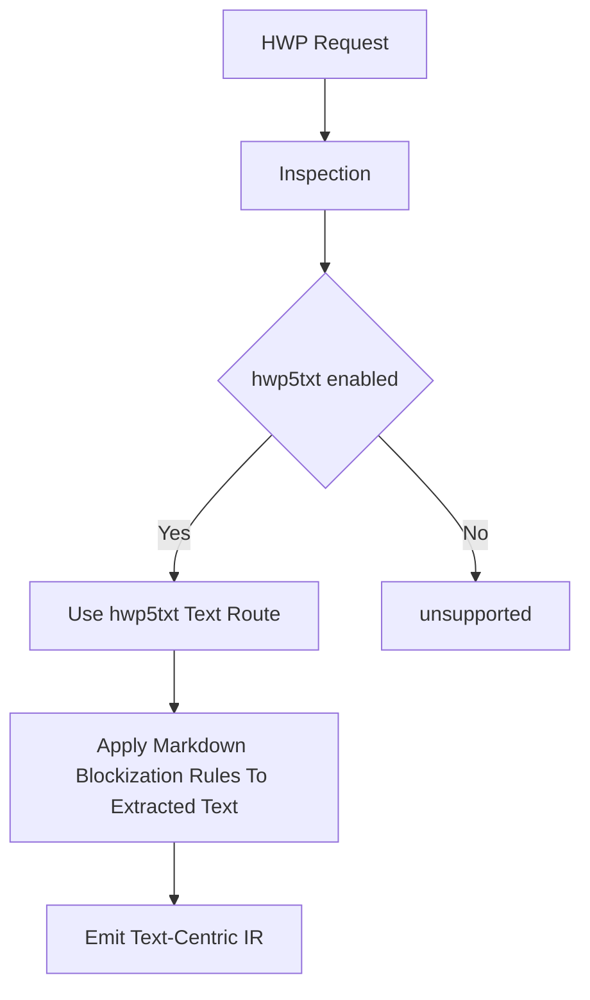

# Parsing Runtime and Decision Tree Guide

## 1. Purpose

This document is the Confluence-friendly version of the current MarkBridge parsing documentation.

It is intended to explain:

- how parsing currently works end to end,
- how routing decisions are made,
- which parser-internal rulesets are applied after format branching,
- how validation and handoff decisions are derived,
- what quality signals are currently used.

## 2. Scope

This document covers:

- source acquisition,
- format resolution,
- deterministic inspection,
- runtime-aware routing,
- parser execution,
- parser-internal rulesets,
- markdown rendering,
- validation,
- repair candidate generation,
- downstream handoff decisions.

This document does not cover:

- downstream chunking,
- embeddings,
- retrieval orchestration,
- answer generation.

## 3. Key Terms

| Term | Meaning |
|---|---|
| Source Acquisition | Step that receives an uploaded file or downloads an S3 object for parsing |
| Document Format | Logical input format such as PDF, DOCX, XLSX, DOC, HWP |
| Inspection | Deterministic, low-cost feature extraction performed before parser execution |
| Runtime Status | Current installed and enabled parser availability in the running environment |
| Baseline Parser | Default deterministic parser selected by routing |
| Parser Override | Alternative parser selected by valid parser hint or LLM comparison result |
| Preferred Markdown | Markdown emitted directly by a parser and preserved as preferred output |
| IR | Intermediate Representation used as the common structure after parsing |
| Validation Issue | Deterministic quality issue found after rendering |
| Handoff Decision | Final output state: `accept`, `degraded_accept`, or `hold` |
| Route Kind | Route role such as `primary`, `fallback`, `degraded_fallback`, or `text_route` |

## 4. End-to-End Flow

1. Acquire source from upload or S3.
2. Resolve document format from supported suffix.
3. Run deterministic inspection.
4. Load runtime parser availability.
5. Select baseline parser.
6. Optionally compare an LLM-recommended parser against the baseline.
7. Execute parser and build IR.
8. Render markdown and markdown line map.
9. Run validation checks.
10. Compute downstream handoff decision.
11. Generate repair candidates and export run artifacts.

## 5. Global Decision Tree

## 6. Global Rulesets

### 6.1 Flow Rulesets

| Rule ID | Trigger | Action | Risk |
|---|---|---|---|
| `flow.source.upload_or_s3` | Request starts from upload or S3 | Uses different acquisition path but same downstream pipeline | Source acquisition failures happen before parsing starts |
| `flow.format.supported_suffix_gate` | Suffix matches supported formats | Allows parse pipeline to continue | Wrong file extension may mislead format resolution |
| `flow.inspection.before_parse` | Parse request accepted | Runs inspection before parser execution | Inspection is advisory, not a full fidelity judgment |
| `flow.render_then_validate` | Parser output exists | Renders markdown first, validates after rendering | Rendering quality affects issue-to-line mapping |
| `flow.export_after_handoff` | Handoff decision is computed | Exports trace, markdown, issues, manifest, and side artifacts | Failed or degraded runs still create artifacts that must be interpreted with status |

### 6.2 Routing Rulesets

| Rule ID | Trigger | Action | Risk |
|---|---|---|---|
| `routing.override.parser_hint` | Parser hint is a valid executable candidate | Uses the hinted parser before baseline routing | A valid but weaker parser can still be forced |
| `routing.pdf.docling_first` | PDF and `docling` is enabled | Selects `docling` as baseline | Heavier route than text-only extraction |
| `routing.pdf.pypdf_fallback` | PDF and `docling` unavailable but `pypdf` enabled | Selects `pypdf` | Layout and table fidelity can drop |
| `routing.docx.python_docx_only` | DOCX and `python-docx` enabled | Selects `python-docx` | No active alternative route for comparison |
| `routing.xlsx.openpyxl_only` | XLSX and `openpyxl` enabled | Selects `openpyxl` | No active alternative route for comparison |
| `routing.doc.libreoffice_first` | DOC and `libreoffice` enabled | Uses conversion route first | Conversion quality affects downstream parsing |
| `routing.doc.antiword_fallback` | DOC and only `antiword` enabled | Uses text fallback route | Structural fidelity can degrade heavily |
| `routing.hwp.hwp5txt_text_route` | HWP and `hwp5txt` enabled | Uses text route | Not a layout-aware parser |

### 6.3 LLM Routing Rulesets

| Rule ID | Trigger | Action | Risk |
|---|---|---|---|
| `routing.llm.compare_before_override` | LLM recommendation differs from baseline | Runs baseline and candidate, then compares quality | Higher latency and cost |
| `routing.llm.keep_baseline_if_not_better` | Candidate quality is not better | Keeps baseline parser | Recommendation may be visible but not applied |
| `routing.quality.heading_count` | Markdown generated | Uses heading count as a structure-preservation signal | Weak signal for heading-light documents |
| `routing.quality.long_line_ratio` | Markdown generated | Uses long-line ratio as collapse-risk signal | Can over-penalize naturally long lines |
| `routing.quality.corruption_density` | Validation issues exist or may exist | Uses corruption and formula placeholder density | Only reflects what current validators detect |

### 6.4 Validation and Handoff Rulesets

| Rule ID | Trigger | Action | Risk |
|---|---|---|---|
| `validation.empty_output` | No blocks and blank markdown | Creates `empty_output` error | Parser failure is only surfaced after rendering |
| `validation.text_corruption` | Broken glyphs, private-use glyphs, or formula placeholders found | Creates `text_corruption` warning | Visual inspection alone may miss formula damage |
| `validation.table_structure` | Table header missing or row widths vary unexpectedly | Creates `table_structure` warning or error | Merged tables and corrupted tables are not perfectly separated |
| `handoff.error_to_hold` | Any error issue exists | Sets handoff to `hold` | Sensitive to false-positive error classification |
| `handoff.warning_to_degraded_accept` | Only warning issues exist | Sets handoff to `degraded_accept` | Downstream systems must interpret warning-grade risk |
| `handoff.degraded_route_adjustment` | Route kind is `degraded_fallback` or `text_route` | Downgrades handoff conservatively | Even low-issue outputs can remain degraded |

## 7. Parser Ruleset Layer

After format branching, parsing does not stop at "choose one parser". Each selected parser applies a second layer of rulesets.

### Common Parser Rulesets

| Rule ID | Trigger | Action | Risk |
|---|---|---|---|
| `common.markdown.preferred` | Preferred markdown exists | Renderer uses parser-produced markdown directly | Line map quality depends on parser markdown quality |
| `common.markdown.line_map_from_metadata` | `markdown_line_numbers` metadata exists | Builds explicit line map from stored line numbers | Bad metadata causes bad highlights |
| `common.markdown.line_map_fallback_match` | Explicit line mapping is missing or partial | Uses heuristic line matching | Exact line correspondence may degrade |

## 8. Format-Specific Trees and Rulesets

### 8.1 PDF

| Rule ID | Trigger | Action | Risk |
|---|---|---|---|
| `pdf.docling.export_markdown` | `docling` selected | Uses `export_to_markdown()` output | Export quality directly affects parse quality |
| `pdf.docling.ocr_disabled` | Docling converter is created | Disables OCR and enrichment options | Image-heavy PDFs can remain weakly parsed |
| `pdf.markdown.heading_split` | Markdown line starts with `#` | Emits heading block and level | Heading quality depends on parser markdown |
| `pdf.markdown.list_split` | Markdown line starts with list marker | Emits list block | List boundaries may differ from source layout |
| `pdf.markdown.table_split` | Markdown row pattern detected | Emits `TableBlockIR` and row-length metadata | Complex tables may not survive markdown flattening |
| `pdf.markdown.line_numbers` | Markdown block created | Attaches `markdown_line_numbers` metadata | Highlight mapping becomes parser-line dependent |
| `pdf.pypdf.page_to_paragraph` | `pypdf` page text is non-empty | Emits one paragraph block per page | Heading and table information can disappear |

### 8.2 DOCX

| Rule ID | Trigger | Action | Risk |
|---|---|---|---|
| `docx.iter.source_order` | `python-docx` selected | Walks paragraphs and tables in body order | OOXML irregularities can affect expected order |
| `docx.heading.style_priority` | Heading or title style detected | Emits heading block from style | Highly dependent on source style quality |
| `docx.heading.numbered_pattern` | Numbered heading regex matches | Treats paragraph as heading and assigns level | Can misclassify numbered list items |
| `docx.heading.korean_section` | `제 n 장/절/조` pattern matches | Treats paragraph as structured section heading | Can collide with inline legal phrasing |
| `docx.heading.circled_number` | Circled-number heading pattern plus local context matches | Treats paragraph as section heading | Can be confused with step lists |
| `docx.heading.short_title` | Short-title heuristic matches | Promotes short paragraph to heading | Short descriptive sentences can be promoted incorrectly |
| `docx.table.layout_detection` | Table rows behave like single-cell layout lines | Reinterprets table as note/text structure | True one-column tables can be misclassified |
| `docx.table.horizontal_duplicate_suppression` | Merged-text duplicates repeat horizontally | Clears duplicate labels | Meaningful repeated labels can weaken |
| `docx.table.header_span_expand` | Empty header cell is inferred to inherit previous label | Expands header span rightward | Empty but independent columns can be overfilled |
| `docx.table.header_row_merge` | Top two header rows satisfy merge pattern | Collapses two-row header into one merged header | Multi-level header meaning can compress |
| `docx.table.repeated_header_refine` | Header labels repeat | Rewrites repeated labels into more specific names | Output wording can diverge from source wording |
| `docx.table.carry_forward_sparse_cells` | Sparse front label cell satisfies carry-forward condition | Fills label from previous row | Row semantics can change if over-applied |
| `docx.table.drop_empty_columns` | Entirely empty column exists | Removes empty column | Empty spacing columns are lost |

### 8.3 XLSX

| Rule ID | Trigger | Action | Risk |
|---|---|---|---|
| `xlsx.sheet_heading` | Sheet title is non-empty | Emits sheet name as heading block | Sheet names are not always semantic section titles |
| `xlsx.cell_nonempty_only` | Cell has non-`None` value | Emits `TableCellIR` only for non-empty cells | Empty spacing semantics are not preserved |
| `xlsx.first_row_header_assumption` | Table cells emitted from row 0 | Treats first row as header | Real header may span multiple rows or appear later |
| `xlsx.merged_cell_signal` | Merged range exists | Flags table as merged | Exact merge span is not reconstructed |
| `xlsx.formula_literal_preserve` | Workbook opened for parsing | Uses `data_only=False` and preserves formula literals | Less convenient for consumers wanting evaluated values |

### 8.4 DOC

| Rule ID | Trigger | Action | Risk |
|---|---|---|---|
| `doc.libreoffice.convert_then_docx` | `libreoffice` route selected | Converts DOC to DOCX then reuses DOCX rulesets | Conversion loss can be irreversible |
| `doc.antiword.text_fallback` | `antiword` route selected | Extracts text then applies markdown blockization | Structural fidelity can drop sharply |
| `doc.antiword.preferred_markdown` | `antiword` extraction succeeds | Uses extracted text as preferred markdown | Extraction artifacts remain visible in final output |

### 8.5 HWP

| Rule ID | Trigger | Action | Risk |
|---|---|---|---|
| `hwp.hwp5txt.text_route` | `hwp5txt` route selected | Extracts text then applies markdown blockization | Remains text-route oriented rather than layout-aware |
| `hwp.hwp5txt.preferred_markdown` | Extraction succeeds | Uses extracted text as preferred markdown | Line breaks and structure markers depend entirely on extracted text quality |

## 9. Repair Rulesets

| Rule ID | Trigger | Action | Risk |
|---|---|---|---|
| `repair.formula.class_gate` | `text_corruption` is formula-like | Allows formula repair candidate generation | General glyph corruption does not enter this path |
| `repair.formula.placeholder_llm_required` | Corruption class is `formula_placeholder` | Creates `llm_required` repair candidate without deterministic patch | Review is required for recovery |
| `repair.formula.private_use_transliteration` | Private-use glyphs exist | Rewrites glyphs using transliteration table | Result may still be mathematically imperfect |
| `repair.formula.normalize_span` | Formula span extracted successfully | Normalizes span and computes confidence | Table labels and formula spans can be confused |

## 10. Quality Signals

### 10.1 Validation Signals

- `empty_output`
- `text_corruption`
- `table_structure`

### 10.2 LLM Routing Comparison Signals

- `heading_count`
- `long_line_ratio`
- `very_long_line_ratio`
- `corruption_density`
- `formula_placeholder_density`
- `error_count`

### 10.3 Handoff States

| State | Meaning |
|---|---|
| `accept` | No blocking issue and no degraded-route adjustment |
| `degraded_accept` | Warning-grade issues or degraded/text route applies |
| `hold` | Blocking issue exists or no executable route is available |
