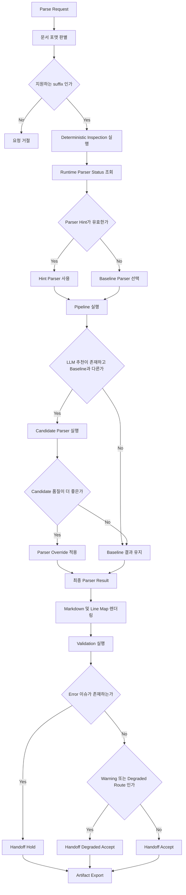
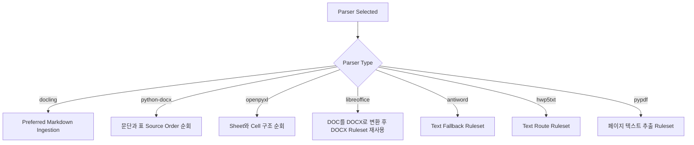
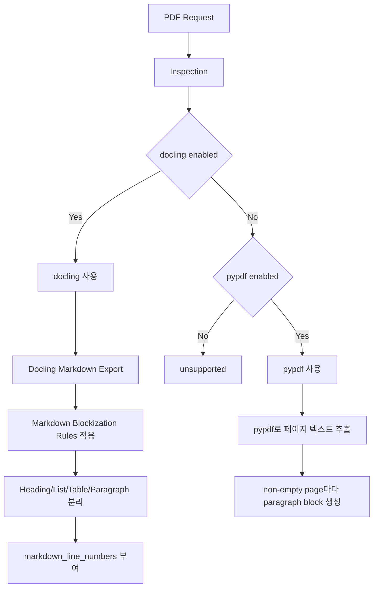
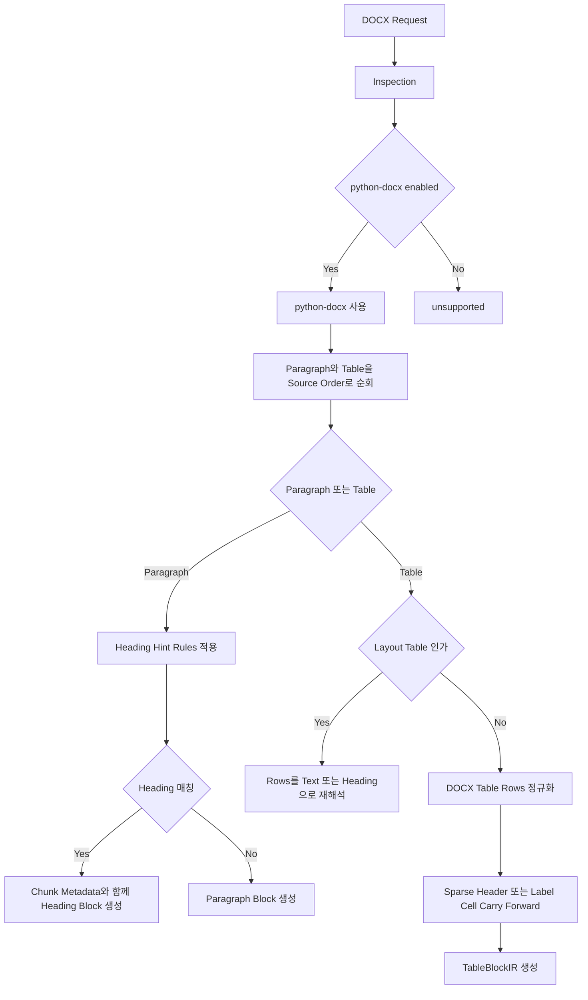
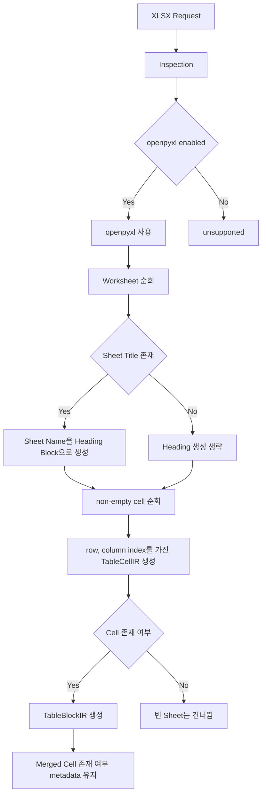
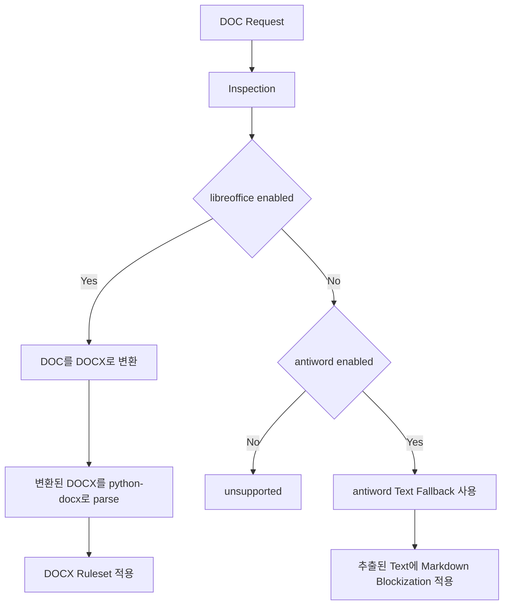
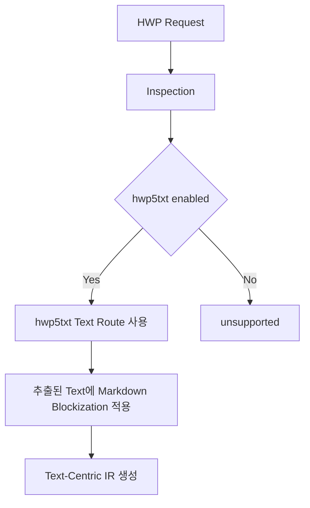

# MarkBridge 파싱 런타임 및 의사결정 가이드

## 1. 문서 목적

이 문서는 MarkBridge의 현재 파싱 동작을 컨플루언스에 바로 옮겨 적을 수 있도록 정리한 통합 문서다.

이 문서의 목적은 아래와 같다.

- 현재 parsing이 end-to-end로 어떻게 동작하는지 설명
- routing 의사결정이 어떤 기준으로 내려지는지 설명
- 파일 포맷 분기 이후 parser 내부 ruleset이 어떻게 적용되는지 설명
- validation과 handoff 결정 기준을 설명
- 현재 품질 판단에 쓰는 핵심 신호를 정리

문서 역할은 아래처럼 구분하는 것을 기준으로 한다.

- 이 문서: 컨플루언스 게시용 통합 기준 문서
- [27-current-parsing-runtime.md](/home/intak.kim/project/MarkBridge/docs/27-current-parsing-runtime.md): 현재 runtime 동작을 더 자세히 설명하는 상세 문서
- [28-parsing-decision-tree.md](/home/intak.kim/project/MarkBridge/docs/28-parsing-decision-tree.md): decision tree와 ruleset 표를 중심으로 보는 보조 문서

## 2. 문서 범위

이 문서는 아래 범위를 포함한다.

- source acquisition
- format resolution
- deterministic inspection
- runtime-aware routing
- parser execution
- parser-internal ruleset
- markdown rendering
- validation
- repair candidate generation
- downstream handoff decision

이 문서는 아래 범위를 포함하지 않는다.

- downstream chunking
- embedding generation
- retrieval orchestration
- answer generation

## 3. 핵심 용어

| 용어 | 의미 |
|---|---|
| Source Acquisition | 외부 입력을 받아 parse 가능한 로컬 작업 파일로 준비하는 단계 |
| Document Format | 입력 파일의 논리 포맷. 현재 PDF, DOCX, XLSX, DOC, HWP를 의미 |
| Inspection | parser 실행 전에 수행하는 저비용 deterministic feature extraction 단계 |
| Runtime Status | 현재 실행 환경에서 parser가 설치되어 있고 활성화되어 있는지 나타내는 상태 |
| Baseline Parser | deterministic routing이 기본으로 선택한 parser |
| Parser Override | parser hint 또는 LLM 비교 결과에 따라 baseline 대신 선택된 parser |
| Preferred Markdown | parser가 직접 만든 markdown을 우선 보존하는 출력 경로 |
| IR | parser 이후 공통 구조로 쓰는 Intermediate Representation |
| Block Kind | IR block의 종류. 현재 heading, paragraph, list, note, table 같은 블록 단위를 의미 |
| Table Normalization | parser가 표를 `TableBlockIR`로 만들기 전에 header 정리, carry-forward, 빈 열 제거 같은 보정 규칙을 적용하는 단계 |
| Document Metadata | `DocumentIR.metadata`에 저장되는 문서 수준 메타데이터. 예: `preferred_markdown`, `page_count`, `sheet_count` |
| Block Metadata | block 또는 table 단위에 붙는 메타데이터. 예: `markdown_line_numbers`, `page_number`, `sheet`, `source` |
| Validation Issue | 렌더링 이후 deterministic rule로 탐지한 품질 이슈 |
| Handoff Decision | 최종 결과 상태. `accept`, `degraded_accept`, `hold` 중 하나 |
| Route Kind | parser route의 역할. `primary`, `fallback`, `degraded_fallback`, `text_route` 등 |

## 4. 전체 처리 흐름

1. 입력 source를 획득해 parse 가능한 작업 파일로 준비한다.
2. 지원되는 suffix를 기준으로 document format을 판별한다.
3. deterministic inspection을 실행한다.
4. 현재 runtime의 parser 활성 상태를 확인한다.
5. baseline parser를 선택한다.
6. 필요하면 LLM 추천 parser를 baseline과 비교한다.
7. parser를 실행하고 공통 IR을 만든다.
8. Markdown 텍스트와 markdown line map을 렌더링한다.
9. validation 검사를 수행한다.
10. downstream handoff decision을 계산한다.
11. repair candidate와 run artifact를 생성한다.

## 5. Inspection 단계는 실제로 무엇을 하는가

inspection은 parser를 실행해서 최종 Markdown 텍스트를 만드는 단계가 아니다.
현재 runtime에서 문서를 먼저 가볍게 진단해서 routing과 품질 해석에 쓸 신호를 만드는 단계다.

현재 inspection의 공통 특징:

- OCR을 하지 않는다
- LLM을 호출하지 않는다
- IR을 만들지 않는다
- Markdown 텍스트를 만들지 않는다
- parser 내부 heading/table normalization ruleset을 적용하지 않는다

중요한 점:

- 현재 구현은 "앞의 몇 페이지만 inspection"하는 샘플링 방식이 아니다
- 포맷에 따라 문서 전체를 가볍게 순회하는 구조다
- 다만 parsing 본단계처럼 구조 복원까지 하지는 않는다

### 5.1 포맷별 inspection 실제 동작

| 포맷 | inspection에서 실제로 하는 일 | 문서 전체 읽기 여부 | 현재 비용 특성 |
|---|---|---|---|
| PDF | `PdfReader`로 전체 페이지를 순회하며 각 페이지에 대해 `extract_text()` 호출, text 존재 여부와 `|` 개수 집계 | 전체 페이지 순회 | 페이지 수가 많을수록 선형적으로 증가 |
| DOCX | 문서를 열고 전체 paragraph 수, table 수, heading style 존재 여부 계산 | 문서 전체 paragraph/table 목록 사용 | 문단 수와 표 수에 비례 |
| XLSX | workbook 전체 sheet와 전체 cell을 순회하며 merged cell, formula, non-empty cell 집계 | 전체 workbook 순회 | sheet 수와 cell 수에 비례 |
| DOC | `libreoffice`, `antiword` 사용 가능 여부만 확인 | 내용 전체를 읽지 않음 | 매우 낮음 |
| HWP | `hwp5txt` 사용 가능 여부만 확인 | 내용 전체를 읽지 않음 | 매우 낮음 |

### 5.2 PDF inspection 세부 설명

현재 PDF inspection은 전체 PDF를 텍스트 기준으로 가볍게 스캔한다.

실제 동작:

1. `PdfReader`로 PDF를 연다.
2. 전체 페이지 수를 계산한다.
3. 모든 페이지를 순회한다.
4. 각 페이지에서 `extract_text()`를 호출한다.
5. 비어 있지 않은 text page 수를 센다.
6. 텍스트 안의 `|` 개수를 table candidate signal로 누적한다.

현재 산출하는 값:

- `page_count`
- `text_layer_coverage`
- `table_candidate_count`
- `complexity_score`

### 5.3 DOCX inspection 세부 설명

현재 DOCX inspection은 전체 문서를 열고 paragraph와 table 메타 신호를 계산한다.

실제 동작:

1. `DocxDocument`로 문서를 연다.
2. 전체 paragraph list를 만든다.
3. 전체 table 수를 센다.
4. paragraph 전체를 돌며 style name에 `Heading`이 들어가는지 확인한다.

현재 산출하는 값:

- `paragraph_count`
- `table_count`
- `heading_style_availability`
- `complexity_score`

주의:

- 여기서는 heading heuristic을 적용하지 않는다
- numbered heading, short title, layout table 같은 규칙은 parser 본단계에서 적용된다

### 5.4 XLSX inspection 세부 설명

현재 XLSX inspection은 workbook 전체를 순회해 구조 신호를 계산한다.

실제 동작:

1. `load_workbook(data_only=False)`로 workbook을 연다.
2. 전체 worksheet 목록을 가져온다.
3. 전체 sheet에 대해 merged range 수를 센다.
4. 전체 row와 cell을 순회한다.
5. non-empty cell 수를 센다.
6. 문자열이 `=`로 시작하는 cell을 formula cell로 센다.

현재 산출하는 값:

- `sheet_count`
- `merged_cell_count`
- `formula_ratio`
- `complexity_score`

### 5.5 DOC / HWP inspection 세부 설명

DOC와 HWP는 현재 inspection 단계에서 문서 내용을 깊게 읽는 구조가 아니다.

DOC:

- `libreoffice` 가능 여부 확인
- `antiword` 가능 여부 확인
- conversion feasibility와 quality signal 생성

HWP:

- `hwp5txt` 가능 여부 확인
- execution feasibility와 route candidate 생성

즉 DOC와 HWP inspection은 현재 "내용 분석"보다 "실행 가능 route 확인"에 더 가깝다.

### 5.6 inspection 비용 해석

현재 inspection은 포맷에 따라 문서 전체를 훑기 때문에 입력이 커질수록 비용이 늘어난다.
다만 현재 비용은 아래 이유로 본 parsing보다 훨씬 제한적이다.

- OCR 없음
- LLM 없음
- markdown 생성 없음
- IR normalization 없음
- deterministic library 호출 중심

따라서 현재 inspection은 "일부 페이지만 읽는 샘플링"이 아니라 "문서 전체를 가볍게 스캔하는 사전 진단 단계"라고 이해하는 것이 맞다.

### 5.7 inspection 결과 중 LLM에 실제로 전달되는 값

inspection은 포맷별로 여러 값을 계산하지만, 현재 LLM routing recommendation prompt에는 일부만 들어간다.

현재 LLM prompt에 들어가는 inspection 기반 값:

- `page_count`
- `sheet_count`
- `complexity_score`

LLM prompt에 같이 들어가는 다른 값:

- `document_format`
- `source_name`
- `parser_hint`
- `executable_candidates`

현재 inspection 계산값과 LLM 전달값 차이:

| 포맷 | inspection에서 계산하는 값 | 현재 LLM prompt에 실제 전달되는 값 | 현재 전달되지 않는 값 |
|---|---|---|---|
| PDF | `page_count`, `text_layer_coverage`, `table_candidate_count`, `complexity_score` | `page_count`, `complexity_score` | `text_layer_coverage`, `table_candidate_count` |
| DOCX | `paragraph_count`, `table_count`, `heading_style_availability`, `complexity_score` | `complexity_score` | `paragraph_count`, `table_count`, `heading_style_availability` |
| XLSX | `sheet_count`, `merged_cell_count`, `formula_ratio`, `complexity_score` | `sheet_count`, `complexity_score` | `merged_cell_count`, `formula_ratio` |
| DOC | `conversion_feasibility`, `conversion_output_quality_signals` | 직접 전달되는 inspection field는 사실상 없음 | 대부분의 DOC inspection detail |
| HWP | `execution_feasibility`, `execution_route_candidates` | 직접 전달되는 inspection field는 사실상 없음 | 대부분의 HWP inspection detail |

즉 현재 LLM은 inspection 전체를 받는 것이 아니라, 아주 축약된 feature summary만 받는다.

### 5.8 complexity_score 계산 방식

`complexity_score`는 현재 포맷별로 매우 단순한 heuristic으로 계산된다.
정밀한 연속 점수라기보다 "복잡한 신호가 있는가"를 나타내는 현재형 indicator에 가깝다.

| 포맷 | 현재 계산식 | 의미 해석 |
|---|---|---|
| PDF | `float(table_candidate_count > 0)` | 텍스트 안에 `|`가 하나라도 있으면 `1.0`, 아니면 `0.0` |
| DOCX | `float(table_count > 0)` | 표가 하나라도 있으면 `1.0`, 아니면 `0.0` |
| XLSX | `float(merged_cell_count > 0 or formula_cells > 0)` | merged cell 또는 formula cell이 하나라도 있으면 `1.0`, 아니면 `0.0` |
| DOC | 현재 별도 complexity score 계산 없음 | route feasibility 중심 |
| HWP | 현재 별도 complexity score 계산 없음 | route feasibility 중심 |

주의:

- 현재 `complexity_score`는 세밀한 난이도 점수가 아니다
- 사실상 0 또는 1에 가까운 boolean-style signal이다
- 표 하나, formula cell 하나 같은 단일 신호만 있어도 1.0이 될 수 있다

따라서 현재 LLM routing에서 `complexity_score`는 "구조적 복잡성의 정밀 추정치"가 아니라 "복잡한 징후가 보이는가" 정도로 해석하는 것이 맞다.

### 5.9 현재 LLM routing recommendation의 유효성과 한계

현재 구조에서 LLM routing recommendation은 최종 parser를 단독으로 결정하는 역할이 아니다.
현재 위치는 "보조 추천기"에 가깝다.

이유:

- LLM은 문서 원문 전체를 보지 않는다
- parser output을 보지 않는다
- validation issue를 보지 않는다
- inspection 전체가 아니라 축약된 feature summary만 본다
- `complexity_score`도 매우 거친 heuristic이다

현재 추천 자체의 한계:

- PDF의 `text_layer_coverage`, `table_candidate_count`가 직접 prompt에 안 들어간다
- DOCX의 `paragraph_count`, `table_count`, `heading_style_availability`가 직접 prompt에 안 들어간다
- XLSX의 `merged_cell_count`, `formula_ratio`가 직접 prompt에 안 들어간다
- `complexity_score`가 사실상 0 또는 1에 가까워 세밀한 차이를 잘 설명하지 못한다

그럼에도 현재 구조가 운영상 방어 가능한 이유는, 추천을 그대로 적용하지 않기 때문이다.

실제 동작:

1. baseline parser를 먼저 실행한다.
2. LLM이 다른 parser를 추천하면 candidate parser도 실행한다.
3. 두 결과를 quality signal로 비교한다.
4. candidate가 실제로 더 좋을 때만 override를 적용한다.

따라서 현재 구조는 아래처럼 이해하는 것이 맞다.

- LLM 추천 자체의 유효성: 제한적
- LLM 추천을 포함한 전체 routing 구조의 유효성: 비교적 합리적

한 문장 요약:

현재 LLM routing은 "정밀 추천기"라기보다 "추가 비교 후보를 제안하는 약한 추천기"이며, 최종 신뢰는 실제 parser 결과 비교에서 확보한다.

### 5.10 baseline parser와 candidate parser의 품질 평가 방식

현재 구조에서 LLM routing override는 추천만으로 결정되지 않는다.
최종 판단은 baseline parser와 candidate parser를 실제로 모두 실행해 본 뒤 품질을 비교해서 내려진다.

현재 비교 순서:

1. baseline parser 실행
2. candidate parser 실행
3. 각 결과의 markdown와 validation issue를 읽음
4. 품질 요약값 계산
5. candidate가 실제로 더 좋을 때만 override 적용

즉 inspection 기반 추정 비교가 아니라, 실제 parser output 기반 비교다.

현재 품질 요약에 쓰는 주요 신호:

| 신호 | 의미 | 일반적 해석 |
|---|---|---|
| `heading_count` | markdown heading 수 | 높을수록 구조 보존에 유리 |
| `average_line_length` | 평균 line 길이 | 길수록 구조 붕괴 가능성 증가 |
| `long_line_count` | 180자 이상 line 수 | 많을수록 불리 |
| `very_long_line_count` | 400자 이상 line 수 | 많을수록 더 불리 |
| `long_line_ratio` | 긴 line 비율 | 낮을수록 유리 |
| `very_long_line_ratio` | 매우 긴 line 비율 | 낮을수록 유리 |
| `text_corruption_issue_count` | `text_corruption` issue 수 | 낮을수록 유리 |
| `private_use_count` | private-use glyph 수 | 낮을수록 유리 |
| `formula_placeholder_count` | formula placeholder issue 수 | 낮을수록 유리 |
| `corruption_density` | non-empty line 대비 corruption issue 비율 | 낮을수록 유리 |
| `formula_placeholder_density` | non-empty line 대비 formula placeholder 비율 | 낮을수록 유리 |
| `error_count` | validation error 수 | 낮을수록 유리 |

현재 점수 해석 방식:

- 100점 기준 heuristic score로 시작
- error가 있으면 큰 감점
- corruption density가 높으면 큰 감점
- formula placeholder density가 높으면 추가 감점
- private-use glyph가 많으면 감점
- long line / very long line 비율이 높으면 감점
- heading이 적절히 살아 있으면 가점
- line은 많지만 heading이 전혀 없으면 감점

따라서 현재 모델은 아래 방향을 선호한다.

- 구조가 잘 살아 있는 markdown
- line collapse가 적은 결과
- 깨진 glyph와 formula placeholder가 적은 결과
- validation error가 없는 결과

override 판단의 성격:

- 작은 점수 차이만으로 바로 뒤집지 않는다
- error, corruption, line collapse, heading 보존을 함께 본다
- candidate가 실제로 더 낫다고 볼 수 있을 때만 적용한다

현재 장점:

- LLM 추천을 직접 신뢰하지 않는다
- 실제 parser 결과를 기준으로 비교한다
- 구조 보존과 corruption을 동시에 본다

현재 한계:

- visual fidelity를 직접 측정하지 않는다
- 표 의미 보존을 완전하게 점수화하지 못한다
- heading 수가 많다고 항상 더 좋은 것은 아니다
- line length 기반 지표는 문서 성격에 따라 과벌점 가능성이 있다

## 6. 전체 Decision Tree

## 7. 전체 공통 Ruleset

### 7.1 Flow Ruleset

| Rule ID | Trigger | Action | Risk |
|---|---|---|---|
| `flow.source.prepare_input` | parse 대상 입력이 시스템에 전달됨 | 입력을 작업 파일로 준비하고 이후 pipeline은 공통으로 진행 | parsing 시작 전에 source acquisition 실패가 날 수 있음 |
| `flow.format.supported_suffix_gate` | suffix가 지원 포맷 목록에 포함됨 | parse pipeline 진입 허용 | 잘못된 파일 확장자가 format 판별을 왜곡할 수 있음 |
| `flow.inspection.before_parse` | parse request가 수락됨 | parser 실행 전에 inspection 수행 | inspection은 보조 신호이지 완전한 품질 판정은 아님 |
| `flow.render_then_validate` | parser output이 IR로 생성됨 | Markdown 텍스트를 먼저 렌더링하고 이후 validation 수행 | rendering 품질이 issue-to-line 매핑 품질에 영향을 줌 |
| `flow.export_after_handoff` | handoff decision이 계산됨 | trace, markdown, issues, manifest 등 산출물 export | failed/degraded run도 artifact가 생성되므로 status를 함께 봐야 함 |

### 7.2 Routing Ruleset

| Rule ID | Trigger | Action | Risk |
|---|---|---|---|
| `routing.override.parser_hint` | parser hint가 executable candidate임 | baseline routing보다 먼저 hint parser 사용 | 유효하지만 더 약한 parser도 강제로 선택될 수 있음 |
| `routing.pdf.docling_first` | PDF이고 `docling`이 enabled 상태 | baseline parser를 `docling`으로 선택 | text-only extractor보다 무거울 수 있음 |
| `routing.pdf.pypdf_fallback` | PDF이고 `docling`은 없지만 `pypdf`는 enabled | baseline parser를 `pypdf`로 선택 | layout과 table fidelity가 약해질 수 있음 |
| `routing.docx.python_docx_only` | DOCX이고 `python-docx`가 enabled | `python-docx` 선택 | 활성 대체 route가 없음 |
| `routing.xlsx.openpyxl_only` | XLSX이고 `openpyxl`가 enabled | `openpyxl` 선택 | 활성 대체 route가 없음 |
| `routing.doc.libreoffice_first` | DOC이고 `libreoffice`가 enabled | conversion route를 우선 사용 | conversion 품질이 후속 parse 품질에 직접 영향 |
| `routing.doc.antiword_fallback` | DOC이고 `antiword`만 enabled | text fallback route 사용 | 구조 fidelity가 크게 낮아질 수 있음 |
| `routing.hwp.hwp5txt_text_route` | HWP이고 `hwp5txt`가 enabled | text route 사용 | layout-aware parser가 아님 |

### 7.3 LLM Routing Ruleset

| Rule ID | Trigger | Action | Risk |
|---|---|---|---|
| `routing.llm.compare_before_override` | LLM recommendation이 baseline과 다름 | baseline과 candidate를 둘 다 실행한 뒤 품질 비교 | latency와 비용 증가 |
| `routing.llm.keep_baseline_if_not_better` | candidate 품질이 baseline보다 낫지 않음 | baseline parser 유지 | recommendation이 보여도 실제 적용되지 않을 수 있음 |
| `routing.quality.heading_count` | Markdown 텍스트가 생성됨 | heading count를 구조 보존 신호로 사용 | heading이 적은 문서에는 정보량이 약함 |
| `routing.quality.long_line_ratio` | Markdown 텍스트가 생성됨 | long-line ratio로 collapse risk 판단 | 원문 자체가 긴 줄 위주면 과벌점 가능 |
| `routing.quality.corruption_density` | validation issue가 존재할 수 있음 | corruption density와 formula placeholder density 반영 | 현재 validator가 잡는 손상만 반영 가능 |

### 7.4 Validation / Handoff Ruleset

| Rule ID | Trigger | Action | Risk |
|---|---|---|---|
| `validation.empty_output` | block이 없고 markdown도 비어 있음 | `empty_output` error 생성 | parser 실패를 validation 단계에서 뒤늦게 노출 |
| `validation.text_corruption` | broken glyph, private-use glyph, formula placeholder 탐지 | `text_corruption` warning 생성 | 육안상 괜찮아 보여도 수식 손상이 포함될 수 있음 |
| `validation.table_structure` | table header 부재 또는 row width variation 이상 | `table_structure` warning 또는 error 생성 | merged table과 구조 손상을 완전히 분리하지 못함 |
| `handoff.error_to_hold` | error issue가 하나라도 존재 | `hold`로 결정 | false-positive error에 민감 |
| `handoff.warning_to_degraded_accept` | warning issue만 존재 | `degraded_accept`로 결정 | downstream이 warning-grade risk를 이해해야 함 |
| `handoff.degraded_route_adjustment` | route kind가 `degraded_fallback` 또는 `text_route` | handoff를 더 보수적으로 낮춤 | issue가 적어도 degraded 상태가 될 수 있음 |

## 8. Parser Ruleset Layer

MarkBridge parsing은 "파일 포맷 분기 -> parser 선택"에서 끝나지 않는다. 선택된 parser는 각각 별도의 내부 ruleset을 적용한다.

### 공통 Parser Ruleset

| Rule ID | Trigger | Action | Risk |
|---|---|---|---|
| `common.markdown.preferred` | `preferred_markdown`이 존재 | renderer가 parser가 생성한 Markdown 텍스트를 직접 사용 | line map 품질이 parser markdown 품질에 종속 |
| `common.markdown.line_map_from_metadata` | `markdown_line_numbers` metadata가 존재 | explicit line number 기반 line map 생성 | 잘못된 metadata가 highlight 품질을 낮춤 |
| `common.markdown.line_map_fallback_match` | explicit line mapping이 없거나 불완전 | heuristic line match 사용 | exact line correspondence가 약해질 수 있음 |

## 9. Markdown 및 line map 렌더링

Markdown 렌더링은 parser가 만든 공통 IR을 사람이 읽을 수 있는 최종 Markdown 문자열로 바꾸는 단계다.
line map 렌더링은 그 Markdown의 각 줄이 어떤 block, cell, page와 연결되는지 기록하는 단계다.

### 9.1 Markdown 렌더링

입력:

- `DocumentIR`
- `BlockIR`
- `TableBlockIR`
- `TableCellIR`

출력:

- 최종 Markdown 텍스트

기본 렌더링 예:

- heading block -> Markdown heading line
- paragraph block -> 문단 텍스트
- note block -> `>` note line
- table block -> Markdown table

### 9.2 preferred_markdown 경로

현재 일부 parser는 Markdown 텍스트를 직접 생성해 `preferred_markdown`으로 넘긴다.

대표 예:

- `docling`
- `antiword`
- `hwp5txt`

이 경우 renderer는 block을 다시 조립하기보다 parser가 만든 Markdown 텍스트를 우선 사용한다.

현재 렌더링 경로는 두 가지다.

1. parser가 만든 `preferred_markdown` 재사용
2. IR block을 순서대로 렌더링해서 Markdown 생성

### 9.3 line map이란 무엇인가

line map은 Markdown 각 줄의 추적 정보다.

현재 line map entry에는 아래 정보가 들어간다.

- `line_number`
- `text`
- `refs`
- `page_number` 가능 시 포함

핵심은 `refs`다.

예:

- `block-3`
- `table cell r2 c4`

즉 어떤 Markdown line이 어떤 block 또는 table cell에서 왔는지 추적할 수 있게 해준다.

### 9.4 line map이 필요한 이유

line map이 없으면 validation issue와 실제 Markdown line을 연결하기 어렵다.

현재 line map의 역할:

- validation issue를 Markdown 줄과 연결
- UI highlight 위치 계산
- block export API의 line range 계산
- 줄 단위 page hint 제공

즉 Markdown는 사람이 읽는 결과이고, line map은 그 결과의 설명 가능성과 추적성을 보강하는 sidecar다.

### 9.5 현재 line map 생성 방식

현재는 두 가지 방식이 있다.

1. explicit metadata 기반
2. heuristic matching 기반

explicit metadata 기반:

- block metadata에 `markdown_line_numbers`가 있으면 그 줄 번호를 그대로 사용한다

heuristic matching 기반:

- explicit line number가 없거나 부족하면
- renderer가 예상 rendered line과 실제 markdown line을 비교해 가장 비슷한 줄을 찾는다

즉 `preferred_markdown`을 그대로 쓰는 경우에도 line map은 별도로 연결해야 한다.

### 9.6 table 렌더링의 특수성

table block은 일반 paragraph보다 더 세밀한 추적 정보가 필요하다.

현재 table 렌더링 시:

- header line 생성
- separator line 생성
- row line 생성
- row/cell 수준 ref를 line map에 함께 기록

또한 merged cell signal이 있는 complex table은 table 앞에 안내 line을 추가할 수 있다.

예:

- `[Complex table preserved: table-id]`

### 9.7 canonical block JSON

MarkBridge는 canonical Markdown 전체만 제공하지 않고, 그 Markdown를 다시 block 경계로 나눈 canonical block 목록도 제공한다.

이 block 목록은 downstream이 아래 용도로 사용한다.

- heading, paragraph, list, note, table 단위 chunking
- block 단위 재색인
- block별 부분 다운로드
- line range 기반 highlight 또는 issue 매핑

현재 canonical block JSON의 block item에는 아래 정보가 담긴다.

| 필드 | 의미 | 현재 생성 방식 |
|---|---|---|
| `block_id` | block 식별자 | 문서 내 순번 기준으로 `block-0001` 형태로 생성 |
| `block_index` | 문서 내 block 순서 | canonical block 생성 순서대로 1부터 증가 |
| `block_kind` | block 종류 | line 패턴을 기준으로 `heading`, `paragraph`, `list`, `table`, `note` 중 하나로 판정 |
| `markdown_line_start` | block 시작 line 번호 | canonical Markdown에서 block가 시작하는 줄 번호 |
| `markdown_line_end` | block 종료 line 번호 | canonical Markdown에서 block가 끝나는 줄 번호 |
| `page_number` | 대표 페이지 번호 | 해당 line range 안의 `markdown_line_map`에서 가장 많이 나타난 page 번호 |
| `block_download_url` | 개별 block 다운로드 경로 | `/exports/parse-markdown/{document_id}/blocks/{block_id}/content` 형태로 생성 |
| `chunk_boundary_candidate` | chunk boundary 후보 여부 | 현재는 `block_kind == "heading"`일 때만 `true` |

현재 canonical block은 parser가 직접 반환하는 IR block과 동일 객체가 아니다.
현재 구현은 최종 canonical Markdown를 다시 훑어서 block 경계를 만든다.

현재 block 경계 생성 규칙의 핵심은 아래와 같다.

- blank line이 나오면 현재 block을 종료한다
- heading line은 항상 독립 block으로 분리한다
- `>`로 시작하면 `note`
- `|`로 시작하는 줄 묶음은 `table`
- `- `, `* `, `1. ` 같은 패턴은 `list`
- 그 외 일반 텍스트 묶음은 `paragraph`

즉 canonical block JSON은 "원래 parser 내부 block을 그대로 노출한 것"이라기보다, "최종 canonical Markdown를 downstream 친화적인 경계로 다시 나눈 결과"로 이해하는 것이 맞다.

한계도 있다.

- parser 내부 IR block 경계와 canonical block 경계가 항상 일치하지는 않는다
- `page_number`는 block 전체의 단일 대표값이라 다중 페이지 block을 완전히 표현하지 못한다
- 현재 `chunk_boundary_candidate`는 heading 위주 규칙이라 table이나 note 중심 chunking 의도를 충분히 표현하지 못한다

API 응답 형식과 예시는 [25-parse-markdown-export-api-confluence.md](/home/intak.kim/project/MarkBridge/docs/25-parse-markdown-export-api-confluence.md)에서 더 자세히 볼 수 있다.

## 10. 포맷별 Decision Tree 및 Ruleset

### 10.1 PDF

| Rule ID | Trigger | Action | Risk |
|---|---|---|---|
| `pdf.docling.export_markdown` | `docling` 선택 | `export_to_markdown()` 결과 사용 | export 품질이 parse 품질에 직접 영향 |
| `pdf.docling.ocr_disabled` | docling converter 생성 | OCR과 enrichment 옵션 비활성화 | image-heavy PDF는 취약 |
| `pdf.markdown.heading_split` | markdown line이 `#`로 시작 | heading block과 level 생성 | parser heading 품질에 의존 |
| `pdf.markdown.list_split` | markdown line이 list marker로 시작 | list block 생성 | list 경계가 원문과 다를 수 있음 |
| `pdf.markdown.table_split` | markdown row pattern 탐지 | `TableBlockIR`와 row-length metadata 생성 | complex table 손실 가능 |
| `pdf.markdown.line_numbers` | markdown block 생성 | `markdown_line_numbers` metadata 부여 | highlight mapping이 parser line에 종속 |
| `pdf.pypdf.page_to_paragraph` | `pypdf` page text가 non-empty | page별 paragraph block 생성 | heading/table 정보가 사라질 수 있음 |

### 10.2 DOCX

| Rule ID | Trigger | Action | Risk |
|---|---|---|---|
| `docx.iter.source_order` | `python-docx` 선택 | paragraph/table을 body order로 순회 | OOXML irregularity가 있으면 기대 순서와 다를 수 있음 |
| `docx.heading.style_priority` | heading/title style 탐지 | style 기반 heading block 생성 | source style 품질에 민감 |
| `docx.heading.numbered_pattern` | numbered heading regex match | paragraph를 heading으로 인식하고 level 계산 | numbered list를 오탐할 수 있음 |
| `docx.heading.korean_section` | `제 n 장/절/조` 패턴 match | structured section heading으로 인식 | 문장 내부 법조문 표현과 충돌 가능 |
| `docx.heading.circled_number` | circled-number pattern과 local context match | section heading으로 인식 | step list와 혼동 가능 |
| `docx.heading.short_title` | short-title heuristic match | 짧은 문단을 heading으로 승격 | 짧은 설명문을 잘못 승격할 수 있음 |
| `docx.table.layout_detection` | single-cell line 형태의 table rows | note/text 구조로 재해석 | 실제 one-column table 오분류 가능 |
| `docx.table.horizontal_duplicate_suppression` | merged-text duplicate가 가로로 반복 | duplicate label 제거 | 의미 있는 repeated label이 약해질 수 있음 |
| `docx.table.header_span_expand` | empty header cell이 이전 label을 이어받는다고 판단 | header span 확장 | 독립 empty column이 과채움될 수 있음 |
| `docx.table.header_row_merge` | 상단 2개 header row가 merge pattern 충족 | 2행 header를 1행 merged header로 축약 | multi-level header 의미 압축 |
| `docx.table.repeated_header_refine` | header label 반복 | 더 구체적인 label로 재작성 | source wording과 달라질 수 있음 |
| `docx.table.carry_forward_sparse_cells` | sparse label cell이 carry-forward 조건 충족 | 이전 row 값을 현재 row 앞단 cell에 보정 | row semantics 왜곡 가능 |
| `docx.table.drop_empty_columns` | 완전 빈 column 존재 | empty column 제거 | spacing purpose의 빈 열 손실 |

### 10.3 XLSX

| Rule ID | Trigger | Action | Risk |
|---|---|---|---|
| `xlsx.sheet_heading` | sheet title이 non-empty | sheet name을 heading block으로 생성 | sheet 이름이 실제 section 제목이 아닐 수 있음 |
| `xlsx.cell_nonempty_only` | cell value가 non-`None` | non-empty cell만 `TableCellIR`로 적재 | empty spacing 의미 미보존 |
| `xlsx.first_row_header_assumption` | row 0에서 table cell 적재 | 첫 행을 header로 간주 | 실제 header가 여러 행일 수 있음 |
| `xlsx.merged_cell_signal` | merged range 존재 | table을 merged로 표시 | merge span 자체는 복원되지 않음 |
| `xlsx.formula_literal_preserve` | workbook open | `data_only=False`로 formula literal 보존 | 계산 결과 중심 소비자에겐 불편 가능 |

### 10.4 DOC

| Rule ID | Trigger | Action | Risk |
|---|---|---|---|
| `doc.libreoffice.convert_then_docx` | `libreoffice` route 선택 | DOC를 DOCX로 변환 후 DOCX ruleset 재사용 | conversion loss가 생기면 복구 어려움 |
| `doc.antiword.text_fallback` | `antiword` route 선택 | text extraction 후 markdown blockization 적용 | 구조 fidelity 급락 가능 |
| `doc.antiword.preferred_markdown` | `antiword` extraction 성공 | extracted text를 preferred markdown으로 사용 | extraction artifact가 그대로 노출 |

### 10.5 HWP

| Rule ID | Trigger | Action | Risk |
|---|---|---|---|
| `hwp.hwp5txt.text_route` | `hwp5txt` route 선택 | text extraction 후 markdown blockization 적용 | layout-aware parser가 아니라 text route 중심 |
| `hwp.hwp5txt.preferred_markdown` | extraction 성공 | extracted text를 preferred markdown으로 사용 | line break와 구조 표식 품질이 extracted text에 전적으로 의존 |

## 11. Repair Ruleset

| Rule ID | Trigger | Action | Risk |
|---|---|---|---|
| `repair.formula.class_gate` | `text_corruption`이 formula-like로 분류됨 | formula repair candidate 생성 허용 | 일반 glyph corruption은 이 경로를 타지 않음 |
| `repair.formula.placeholder_llm_required` | corruption class가 `formula_placeholder` | deterministic patch 없이 `llm_required` candidate 생성 | review가 필수 |
| `repair.formula.private_use_transliteration` | private-use glyph 존재 | transliteration table로 문자 치환 | 수학적으로 완전하지 않을 수 있음 |
| `repair.formula.normalize_span` | formula span 추출 성공 | 수식 span 정규화 및 confidence 계산 | table label과 formula span 혼동 가능 |

## 12. 품질 판단 신호

### 12.1 Validation Signal

- `empty_output`
- `text_corruption`
- `table_structure`

### 12.2 LLM Routing Comparison Signal

- `heading_count`
- `long_line_ratio`
- `very_long_line_ratio`
- `corruption_density`
- `formula_placeholder_density`
- `error_count`

### 12.3 Handoff State

| 상태 | 의미 |
|---|---|
| `accept` | blocking issue가 없고 degraded-route adjustment도 없음 |
| `degraded_accept` | warning-grade issue가 있거나 degraded/text route가 적용됨 |
| `hold` | blocking issue가 있거나 executable route가 없음 |

## 13. validation은 누가, 어떻게 수행하는가

현재 validation은 LLM이 아니라 deterministic validator가 수행한다.

실행 주체:

- `validate_document()` in `validators/execution.py`

호출 주체:

- pipeline orchestrator

즉 parser와 renderer가 끝난 뒤 pipeline이 validation을 실행한다.

### 13.1 수행 시점

현재 순서:

1. parser가 `DocumentIR` 생성
2. renderer가 markdown 생성
3. validator가 `DocumentIR`와 `markdown_text`를 받아 검사
4. `ValidationReport` 생성
5. handoff decision 계산
6. repair candidate generation

즉 validation은 parser 결과 이후에 수행되는 사후 품질 검사다.

### 13.2 입력

현재 validator 입력:

- `DocumentIR`
- `markdown_text`

이유:

- block 구조에서 더 잘 보이는 문제가 있음
- 최종 markdown 텍스트에서 더 잘 보이는 문제가 있음

### 13.3 현재 수행하는 검사

현재 핵심 검사는 세 가지다.

1. `empty_output`
2. `text_corruption`
3. `table_structure`

#### empty_output

- block도 없고 markdown도 비어 있으면 생성
- severity는 `ERROR`

#### text_corruption

현재 탐지 대상:

- replacement character `�`
- private-use glyph
- `<!-- formula-not-decoded -->`

검사 방식:

- document block 내부 텍스트 검사
- 필요 시 markdown 전체도 검사

현재 corruption class도 함께 붙인다.

대표 class:

- `symbol_only_corruption`
- `inline_formula_corruption`
- `table_formula_corruption`
- `formula_placeholder`
- `structure_loss`

#### table_structure

현재 `TableBlockIR`에 대해 수행된다.

현재 보는 기준:

- header row 부재
- row width variation 이상

merged cell signal이 있거나 markdown table source인 경우에는 경고 쪽으로 더 완화해서 본다.

### 13.4 validation issue에 포함되는 정보

현재 issue는 구조화된 레코드다.

대표 필드:

- `issue_id`
- `code`
- `severity`
- `message`
- `location`
- `excerpts`
- `details`
- `repairable`

즉 validation은 이후 trace, UI highlight, repair 단계에서 다시 사용할 수 있는 evidence를 남긴다.

### 13.5 validation 결과의 사용처

validation 결과는 `ValidationReport`로 묶인다.

대표 summary:

- `issue_count`
- `error_count`
- `warning_count`

현재 이 결과는 아래로 바로 연결된다.

- trace emission
- handoff decision
- repair candidate generation

### 13.6 handoff와의 연결

기본 규칙:

- error issue가 있으면 `hold`
- warning만 있으면 `degraded_accept`
- issue가 없으면 `accept`

추가로 route kind가 `degraded_fallback` 또는 `text_route`면 결과를 더 보수적으로 해석한다.

즉 validation은 단순 리포트가 아니라 downstream 전달 여부를 결정하는 핵심 입력이다.

### 13.7 역할과 한계

현재 역할:

- 빈 결과 탐지
- 깨진 glyph / formula placeholder / table 구조 이상 탐지
- traceable issue record 생성
- handoff와 repair 단계 입력 제공

현재 한계:

- visual fidelity 직접 검증 불가
- 표 의미 보존 완전 검증 불가
- semantic correctness 완전 판단 불가
- heuristic 기반이라 false positive / false negative 가능

즉 현재 validation은 "문서가 완벽한지 증명"하는 단계가 아니라, 운영상 필요한 blocking/degraded 신호를 deterministic하게 생성하는 단계다.

## 14. 컨플루언스 게시 팁

- 이 문서는 markdown 기반이라 컨플루언스에 그대로 붙여넣은 뒤 heading/table/mermaid만 확인하면 된다.
- 컨플루언스 페이지를 분리하려면 아래 순서로 쪼개는 것이 좋다.
  1. 개요 및 용어
  2. 전체 flow 및 공통 ruleset
  3. 포맷별 decision tree 및 ruleset
  4. validation / repair / handoff 기준
